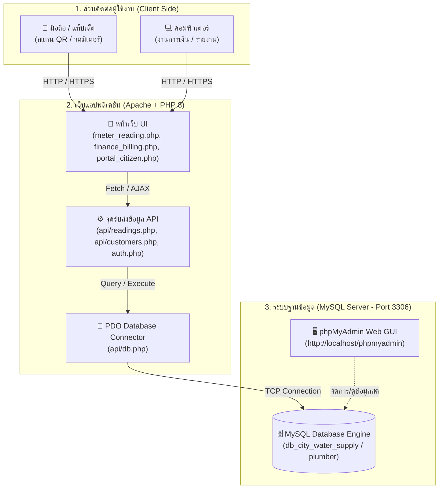
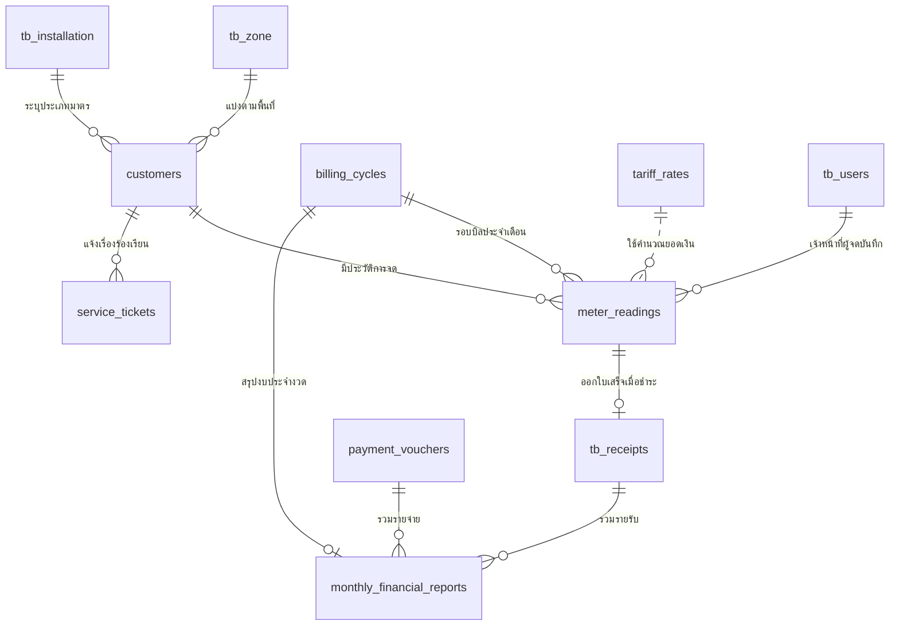

# คู่มือสถาปัตยกรรมและการเชื่อมโยง: phpMyAdmin กับระบบเว็บไซต์การประปา

เอกสารฉบับนี้อธิบายโครงสร้างและการทำงานร่วมกันระหว่าง **phpMyAdmin (ระบบจัดการฐานข้อมูล MySQL)** กับ **ระบบเว็บไซต์การประปาหมู่บ้านวังยาง (PHP Web Application)** เพื่อให้เห็นภาพชัดเจนว่าข้อมูลแต่ละตารางในภาพที่แคปมา ถูกนำไปแสดงผล คำนวณ และอัปเดตในหน้าเว็บส่วนใดบ้าง

---

## 1. ภาพรวมสถาปัตยกรรม (High-Level Integration Architecture)



### กลไกการเชื่อมต่อในโค้ด (The Bridge):
1. **phpMyAdmin** ไม่ใช่ตัวเก็บข้อมูลเอง แต่เป็นเพียง **"หน้าต่างควบคุม (GUI)"** สำหรับดูและจัดการตารางใน MySQL
2. ตัวเว็บไซต์เชื่อมต่อตรงไปยัง MySQL ผ่านไฟล์ `api/db.php` และ `auth.php` โดยใช้คำสั่ง **PDO (PHP Data Objects)**:
   ```php
   $pdo = new PDO("mysql:host=localhost;dbname=db_city_water_supply;charset=utf8mb4", "root", "");
   ```
3. เมื่อเจ้าหน้าที่กดบันทึกบนหน้าเว็บ &rarr; ข้อมูลจะวิ่งเข้าสู่ตารางใน MySQL ทันที &rarr; เมื่อเปิดดูใน phpMyAdmin ก็จะเห็นตัวเลขนั้นเปลี่ยนตามแบบ Real-Time

---

## 2. เจาะลึกความหมายและการเชื่อมโยงของ 16 ตาราง (Table Mapping)

ตารางทั้งหมดในฐานข้อมูลแบ่งออกเป็น **5 หมวดหมู่หลัก** ดังนี้:

### หมวดที่ 1: ข้อมูลผู้ใช้น้ำและการติดตั้ง (Customer & Master Data)

| ชื่อตาราง | วัตถุประสงค์และการเก็บข้อมูล | เชื่อมโยงกับหน้าเว็บใด |
| :--- | :--- | :--- |
| `customers`<br>*(หรือ `tb_customers`)* | **หัวใจหลักของลูกบ้าน:** เก็บ `id`, รหัสผู้ใช้ (`customer_code` เช่น WY-001), ชื่อ-นามสกุล, บ้านเลขที่, เบอร์โทรศัพท์, โซน, ประเภทการใช้น้ำ, พิกัด GPS | • `meter_reading.php` (แสดงรายชื่อลูกบ้านในสมุดจด)<br>• `portal_citizen.php` (ค้นหาค่าน้ำของตัวเอง)<br>• `print_qr_labels.php` (สร้าง QR Code แปะหน้าบ้าน) |
| `tb_zone` | **โซน/คุ้มเดินจดมิเตอร์:** เก็บรายชื่อคุ้ม เช่น คุ้มเหนือ, คุ้มใต้, โซนทุ่งสามัคคี สำหรับจัดระเบียบสายเดินจด | • ดรอปดาวน์คัดกรองโซนในหน้าสมุดจดมิเตอร์<br>• ฟอร์มเพิ่มผู้ใช้น้ำใหม่ |
| `tb_installation` | **ข้อมูลมาตรวัดน้ำและขนาดท่อ:** เก็บขนาดมิเตอร์ (1/2", 3/4"), วันที่เริ่มติดตั้ง, ประเภทการคิดราคา (ครัวเรือน / ร้านค้า) | • ป๊อปอัป "➕ เพิ่มผู้ใช้น้ำ / ติดตั้งมิเตอร์ใหม่" |

---

### หมวดที่ 2: งานจดบันทึกมิเตอร์ภาคสนาม (Field Meter Reading & Consumption)

| ชื่อตาราง | วัตถุประสงค์และการเก็บข้อมูล | เชื่อมโยงกับหน้าเว็บใด |
| :--- | :--- | :--- |
| `billing_cycles` | **รอบบิลประจำเดือน:** เช่น `8-2567` (สิงหาคม 2567), วันเริ่มจด, วันสิ้นสุดรอบ, วันครบกำหนดชำระ | • ตัวเลือกงวดเดือนด้านบนสุดของ `meter_reading.php`<br>• หัวบิลในหน้าการเงิน `finance_billing.php` |
| `meter_readings`<br>*(หรือ `tb_meter_readings`)* | **ตารางบันทึกตัวเลขค่าน้ำ:** เก็บ `customer_id`, `cycle_code`, เลขครั้งก่อน (`previous_reading`), เลขครั้งนี้ (`current_reading`), จำนวนหน่วยที่ใช้ (`units_used`), ยอดรวมเงิน (`grand_total`), สถานะ (`status`: pending/paid) | • **ฟอร์มสแกน QR Code หน้าบ้าน & การ์ดบันทึกด่วน**<br>• ตารางสมุดจดมิเตอร์ทั้งหมด<br>• สถิติความคืบหน้า (จดแล้วกี่หลัง / ยังไม่จดกี่หลัง) |
| `water_loss_logs` | **สถิติน้ำสูญเสียในระบบท่อ (NRW):** เปรียบเทียบปริมาณน้ำดิบที่สูบจ่ายออกจากสถานีผลิต กับน้ำรวมที่จดได้ตามบ้าน เพื่อดูว่ามีท่อแตกรั่วใต้ดินหรือไม่ | • กราฟวิเคราะห์น้ำสูญเสียใน `executive_reports.php`<br>• แดชบอร์ดสรุปผล `dashboard.php` |

---

### หมวดที่ 3: อัตราค่าน้ำ การเงิน และบัญชี (Tariff & Financial Accounting)

| ชื่อตาราง | วัตถุประสงค์และการเก็บข้อมูล | เชื่อมโยงกับหน้าเว็บใด |
| :--- | :--- | :--- |
| `tariff_rates`<br>*(หรือ `tb_water_rates`)* | **โครงสร้างราคาค่าน้ำแบบขั้นบันได:** เช่น 1–10 ลบ.ม. ละ 5 บาท, 11–20 ลบ.ม. ละ 7 บาท + ค่าบริการมิเตอร์ 10 บาท | • ตัวคำนวณค่าน้ำอัตโนมัติบนหน้าเว็บ (คำนวณเงินสดทันทีที่คีย์เลขอ่าน)<br>• แท็บตั้งค่าราคาในหน้าการเงิน |
| `tb_receipts` | **ประวัติการออกใบเสร็จรับเงิน:** เก็บเลขที่ใบเสร็จ (`receipt_no`), ยอดชำระ, วันที่รับเงิน, วิธีชำระ (เงินสด / โอนสแกน PromptPay QR) | • แท็บ "การชำระเงินและออกใบเสร็จ" ใน `finance_billing.php`<br>• สลิปใบเสร็จดิจิทัลใน `portal_citizen.php` |
| `payment_vouchers` | **ใบสำคัญจ่ายเงินของกองการประปา:** ค่าไฟฟ้าปั๊มน้ำ, สารส้ม, คลอรีน, ค่าซ่อมท่อแตก, ค่าตอบแทนช่าง | • แท็บ "รายจ่าย / ใบสำคัญจ่าย" ในหน้าการเงิน |
| `tb_expenses` | **หมวดหมู่รายจ่าย:** แยกประเภทค่าใช้จ่ายเพื่อง่ายต่อการทำบัญชีส่ง อบต./เทศบาล | • ตัวเลือกประเภทค่าใช้จ่ายตอนบันทึกใบสำคัญจ่าย |
| `monthly_financial_reports`<br>*(หรือ `tb_financial_summary`)* | **สรุปงบการเงินประจำเดือน:** รายรับทั้งหมด, รายจ่ายทั้งหมด, ยอดค้างชำระสะสม, กำไรสุทธิ | • หน้าสรุปรายงานผู้บริหาร `executive_reports.php`<br>• กราฟสถิติรายเดือนใน `dashboard.php` |

---

### หมวดที่ 4: งานบริการซ่อมบำรุงและคำร้อง (Service & Ticketing)

| ชื่อตาราง | วัตถุประสงค์และการเก็บข้อมูล | เชื่อมโยงกับหน้าเว็บใด |
| :--- | :--- | :--- |
| `service_tickets` | **คำร้องเรียนและการแจ้งเหตุ:** ท่อแตก, น้ำไม่ไหล, น้ำมีกลิ่น, ขอย้ายมิเตอร์ พร้อมสถานะงาน (รอดำเนินการ / กำลังซ่อม / เสร็จสิ้น) | • เมนูแจ้งปัญหาออนไลน์ในหน้าประชาชน<br>• แดชบอร์ดติดตามงานช่างภาคสนาม |

---

### หมวดที่ 5: สิทธิ์และบัญชีผู้ใช้งาน (Authentication & Users)

| ชื่อตาราง | วัตถุประสงค์และการเก็บข้อมูล | เชื่อมโยงกับหน้าเว็บใด |
| :--- | :--- | :--- |
| `tb_users` | **บัญชีเจ้าหน้าที่และสมาชิก:** บัญชีแอดมิน (`admin`), เจ้าหน้าที่จดมิเตอร์ (`staff`/`reader`), การเงิน (`finance`) และลูกบ้าน (`member`) พร้อมรหัสผ่านความปลอดภัยสูง | • ระบบ Login ผ่าน `auth.php`<br>• การกำหนดสิทธิ์การเข้าถึงเมนูต่างๆ (RBAC) |

---

## 3. แผนผังความสัมพันธ์ของข้อมูล (Entity-Relationship Diagram)



---

## 4. ตัวอย่างการไหลของข้อมูลจริงเมื่อทำงานบนหน้าเว็บ

### กรณีตัวอย่าง: เจ้าหน้าที่เดินไปส่อง QR สติกเกอร์หน้าบ้าน WY-001 (นายสมเกียรติ)
1. **เจ้าหน้าที่เปิดหน้าเว็บ** `meter_reading.php` บนมือถือ &rarr; ระบบส่งคำขอ `GET api/customers.php` &rarr; ดึงข้อมูลจากตาราง `customers` และ `tb_zone` มาแสดงผล
2. **สแกน QR Code หรือ พิมพ์ค้นหาบ้านเลขที่ `24/1`:**
   - ระบบดึงข้อมูลจาก `meter_readings` ของงวดก่อนมาแสดงเป็น **"เลขครั้งก่อน: 120.0"**
3. **เจ้าหน้าที่คีย์เลขมิเตอร์ครั้งนี้ `125.0`:**
   - JavaScript ดึงอัตราค่าน้ำจากตาราง `tariff_rates` มาคำนวณสด: ใช้ไป 5.0 หน่วย &rarr; ยอดรวม 35.00 บาท ทันที
4. **กดปุ่ม `[💾 บันทึก & สแกนหลังถัดไป ⏭️]`:**
   - โค้ดส่งข้อมูลแบบ JSON ไปที่ `POST api/readings.php?action=save`
   - คำสั่ง SQL `INSERT / UPDATE` จะบันทึกลงตาราง `meter_readings`
5. **ตรวจสอบใน phpMyAdmin:**
   - หากเปิด phpMyAdmin ในตาราง `meter_readings` จะเห็นแถวของ `customer_id = 1` อัปเดต `current_reading = 125.0` และ `units_used = 5.0` ในทันที!
