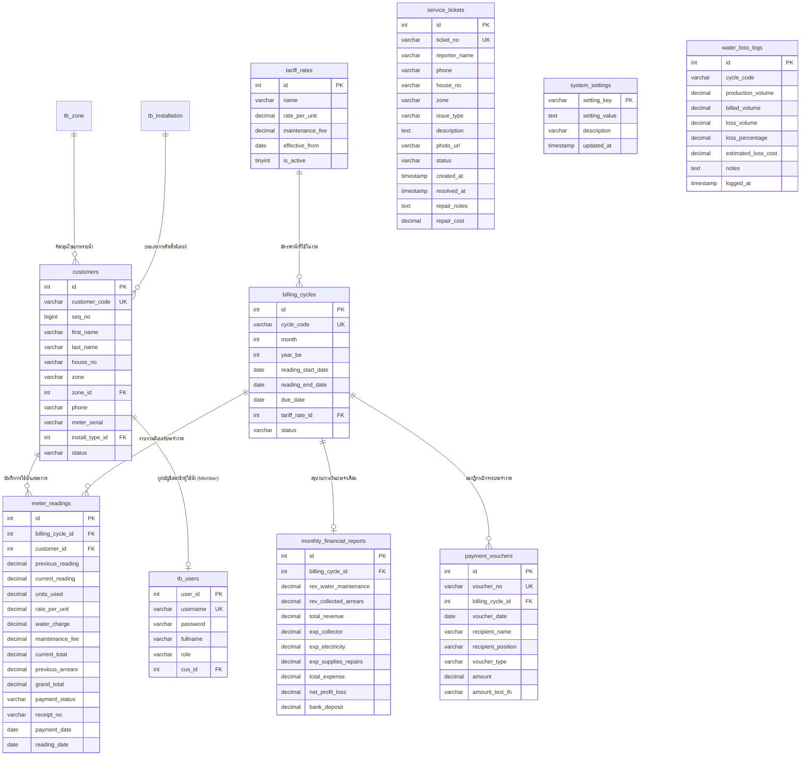

# เอกสารการออกแบบฐานข้อมูลและพจนานุกรมข้อมูล (Database Specification & ER-Diagram)
**ระบบบริหารจัดการน้ำประปาหมู่บ้าน/เทศบาล (Smart Village Water Supply Management System)**  
*หน่วยงาน: การประปาหมู่บ้านวังยาง ตำบลวังยาง อำเภอวังยาง จังหวัดนครพนม*

---

## 1. แผนภาพความสัมพันธ์ข้อมูล (Entity-Relationship Diagram: ERD)

---

## 2. พจนานุกรมข้อมูล (Data Dictionary)

### 2.1 ตาราง `customers` (ข้อมูลสมาชิกผู้ใช้น้ำ)
*คำอธิบาย: เก็บข้อมูลระเบียนสมาชิกผู้ใช้น้ำประจำหมู่บ้าน (แบบ ป.12) รวมถึงเลขที่มิเตอร์และจุดติดตั้ง*

| ฟิลด์ (Field Name) | ชนิดข้อมูล (Data Type) | Null | คีย์ (Key) | คำอธิบาย (Description) |
| :--- | :--- | :---: | :---: | :--- |
| `id` | `INT(4) UNSIGNED ZEROFILL` | NO | PK | รหัสอ้างอิงภายในระบบ (Primary Key) |
| `customer_code` | `VARCHAR(6)` | NO | UK | รหัสผู้ใช้น้ำ เช่น WY-001, WY-002 |
| `seq_no` | `BIGINT(11) UNSIGNED` | NO | - | ลำดับการเดินจดมิเตอร์ตามแนวท่อ |
| `first_name` | `VARCHAR(20)` | NO | - | ชื่อผู้ใช้น้ำ |
| `last_name` | `VARCHAR(30)` | NO | - | นามสกุล |
| `fullname` | `VARCHAR(51)` | NO | - | ชื่อและนามสกุลเต็ม |
| `house_no` | `VARCHAR(20)` | NO | - | บ้านเลขที่ที่ติดตั้งมิเตอร์ |
| `zone` | `VARCHAR(50)` | YES | - | ชื่อโซน เช่น โซน 1 วังยางเหนือ |
| `zone_id` | `INT(2) UNSIGNED ZEROFILL` | NO | FK | รหัสอ้างอิงโซน (`tb_zone.zone_id`) |
| `phone` | `VARCHAR(10)` | NO | - | หมายเลขโทรศัพท์ติดต่อ |
| `meter_serial` | `VARCHAR(8)` | NO | - | หมายเลขซีเรียลประจำมาตรวัดน้ำ |
| `meter_size` | `VARCHAR(50)` | YES | - | ขนาดท่อ/มิเตอร์ เช่น 1/2 นิ้ว |
| `install_type_id` | `INT(1) UNSIGNED ZEROFILL` | NO | FK | รหัสประเภทการติดตั้ง (`tb_installation`) |
| `status` | `VARCHAR(6)` | NO | - | สถานะการใช้น้ำ (ปกติ / ระงับการใช้) |

---

### 2.2 ตาราง `meter_readings` (การจดบันทึกมาตรวัดน้ำและการคิดเงิน แบบ ป.17/31)
*คำอธิบาย: ตารางบันทึกการอ่านเลขมาตรวัดน้ำ คำนวณปริมาณการใช้น้ำ ค่าน้ำประจำงวด และสถานะการชำระเงิน*

| ฟิลด์ (Field Name) | ชนิดข้อมูล (Data Type) | Null | คีย์ (Key) | ค่าเริ่มต้น | คำอธิบาย (Description) |
| :--- | :--- | :---: | :---: | :---: | :--- |
| `id` | `INT(11)` | NO | PK | AUTO_INCREMENT | รหัสระเบียนการจดมิเตอร์ |
| `billing_cycle_id` | `INT(11)` | NO | FK | - | รหัสงวดประจำเดือน (`billing_cycles.id`) |
| `customer_id` | `INT(4) UNSIGNED ZEROFILL` | NO | FK | - | รหัสสมาชิกผู้ใช้น้ำ (`customers.id`) |
| `previous_reading` | `DECIMAL(10,2)` | NO | - | `0.00` | เลขมาตรวัดน้ำครั้งก่อน (ยกมาจากงวดที่แล้ว) |
| `current_reading` | `DECIMAL(10,2)` | NO | - | `0.00` | เลขมาตรวัดน้ำครั้งหลัง (พนักงานจดหน้างาน) |
| `units_used` | `DECIMAL(10,2)` | NO | - | `0.00` | จำนวนหน่วยที่ใช้น้ำ ($Current - Previous$) |
| `rate_per_unit` | `DECIMAL(10,2)` | NO | - | `7.00` | อัตราค่าน้ำต่อหน่วย (บาท) |
| `water_charge` | `DECIMAL(10,2)` | NO | - | `0.00` | ค่าน้ำประปาประจำงวด ($Units \times Rate$) |
| `maintenance_fee` | `DECIMAL(10,2)` | NO | - | `10.00` | ค่าบริการบำรุงรักษาท่อ (บาท/เดือน) |
| `current_total` | `DECIMAL(10,2)` | NO | - | `10.00` | ยอดรวมประจำงวดนี้ ($Water + Maintenance$) |
| `previous_arrears` | `DECIMAL(10,2)` | YES | - | `0.00` | ยอดหนี้ค้างชำระเดิมจากงวดก่อน |
| `grand_total` | `DECIMAL(10,2)` | NO | - | `10.00` | ยอดรวมสุทธิที่ต้องชำระ ($Current + Arrears$) |
| `amount_paid` | `DECIMAL(10,2)` | YES | - | `0.00` | ยอดเงินที่รับชำระแล้วจริง |
| `remaining_balance`| `DECIMAL(10,2)` | YES | - | `0.00` | ยอดคงเหลือค้างจ่าย |
| `payment_status` | `VARCHAR(20)` | YES | - | `UNPAID` | สถานะชำระเงิน (`UNPAID` / `PAID`) |
| `payment_date` | `DATE` | YES | - | NULL | วันที่รับชำระเงิน |
| `receipt_no` | `VARCHAR(50)` | YES | - | NULL | เลขที่ใบเสร็จรับเงิน (เช่น `8-2567/501`) |
| `reading_date` | `DATE` | NO | - | NULL | วันที่เดินจดเลขมิเตอร์ |
| `reader_name` | `VARCHAR(100)` | YES | - | NULL | ชื่อเจ้าหน้าที่ผู้จดมิเตอร์ |

---

### 2.3 ตาราง `service_tickets` (คำร้องออนไลน์ / แจ้งท่อแตก / น้ำรั่ว)
*คำอธิบาย: บันทึกการแจ้งเรื่องร้องเรียนจากประชาชน พร้อมรูปถ่ายหลักฐาน และการแจ้งเตือน LINE Notify*

| ฟิลด์ (Field Name) | ชนิดข้อมูล (Data Type) | Null | คีย์ (Key) | คำอธิบาย (Description) |
| :--- | :--- | :---: | :---: | :--- |
| `id` | `INT(11)` | NO | PK | รหัสคำร้อง (Auto Increment) |
| `ticket_no` | `VARCHAR(50)` | NO | UK | หมายเลขอ้างอิงคำร้อง เช่น `TK-2569-1001` |
| `reporter_name` | `VARCHAR(100)` | NO | - | ชื่อ-นามสกุล ผู้แจ้งเหตุ |
| `phone` | `VARCHAR(30)` | NO | - | เบอร์โทรศัพท์ติดต่อของผู้แจ้ง |
| `house_no` | `VARCHAR(50)` | NO | - | สถานที่ / บ้านเลขที่ / จุดสังเกต |
| `zone` | `VARCHAR(100)` | NO | - | คุ้ม / โซนที่เกิดเหตุ |
| `issue_type` | `VARCHAR(50)` | NO | - | ประเภทปัญหา (ท่อเมนแตก, น้ำไม่ไหล, มิเตอร์ชำรุด) |
| `description` | `TEXT` | YES | - | รายละเอียดอาการที่พบเพิ่มเติม |
| `photo_url` | `VARCHAR(255)` | YES | - | เส้นทางไฟล์รูปถ่ายจุดเกิดเหตุ (`uploads/tickets/...`) |
| `status` | `VARCHAR(30)` | YES | - | สถานะคำร้อง (`PENDING`, `IN_PROGRESS`, `RESOLVED`) |
| `created_at` | `TIMESTAMP` | NO | - | วันเวลาที่ส่งคำร้องเข้าระบบ |
| `resolved_at` | `TIMESTAMP` | YES | - | วันเวลาที่ช่างแก้ไขเสร็จสิ้น |
| `repair_notes` | `TEXT` | YES | - | บันทึกการใช้อุปกรณ์และการซ่อมแซมของช่าง |
| `repair_cost` | `DECIMAL(10,2)` | YES | - | ค่าใช้จ่ายในการซ่อมแซม (บาท) |

---

### 2.4 ตาราง `system_settings` (การตั้งค่าระบบ & LINE Notify)
*คำอธิบาย: เก็บค่าตัวแปรระดับระบบ เช่น LINE Notify Bearer Token, สถานะเปิด/ปิดการแจ้งเตือน*

| ฟิลด์ (Field Name) | ชนิดข้อมูล (Data Type) | Null | คีย์ (Key) | คำอธิบาย (Description) |
| :--- | :--- | :---: | :---: | :--- |
| `setting_key` | `VARCHAR(50)` | NO | PK | ชื่อคีย์การตั้งค่า (เช่น `line_notify_token`, `line_notify_enabled`) |
| `setting_value` | `TEXT` | YES | - | ค่าของตัวแปร |
| `description` | `VARCHAR(255)` | YES | - | คำอธิบายตัวแปรการตั้งค่า |
| `updated_at` | `TIMESTAMP` | NO | - | วันเวลาที่แก้ไขล่าสุด |

---

### 2.5 ตาราง `billing_cycles` (งวดบัญชีประจำเดือน)
*คำอธิบาย: ข้อมูลงวดรอบบิลค่าน้ำประปาในแต่ละเดือน*

| ฟิลด์ (Field Name) | ชนิดข้อมูล (Data Type) | Null | คีย์ (Key) | คำอธิบาย (Description) |
| :--- | :--- | :---: | :---: | :--- |
| `id` | `INT(11)` | NO | PK | รหัสงวดประจำเดือน |
| `cycle_code` | `VARCHAR(20)` | NO | UK | รหัสงวด เช่น `8-2567` (สิงหาคม 2567) |
| `month` | `INT(11)` | NO | - | ลำดับเดือน (1 - 12) |
| `year_be` | `INT(11)` | NO | - | ปี พ.ศ. เช่น 2567 |
| `reading_start_date` | `DATE` | NO | - | วันที่เริ่มเดินจดมิเตอร์ |
| `reading_end_date` | `DATE` | NO | - | วันสิ้นสุดการเดินจด |
| `due_date` | `DATE` | NO | - | วันครบกำหนดชำระเงิน |
| `tariff_rate_id` | `INT(11)` | NO | FK | รหัสอัตราค่าน้ำที่ใช้คำนวณ (`tariff_rates.id`) |
| `status` | `VARCHAR(20)` | YES | - | สถานะงวดบิล (`OPEN` / `CLOSED`) |

---

### 2.6 ตาราง `tb_users` (บัญชียืนยันตัวตน RBAC)
*คำอธิบาย: ตารางเก็บข้อมูลบัญชีผู้ใช้งานระบบ 3 ระดับสิทธิ์ (Admin, Staff, Member)*

| ฟิลด์ (Field Name) | ชนิดข้อมูล (Data Type) | Null | คีย์ (Key) | คำอธิบาย (Description) |
| :--- | :--- | :---: | :---: | :--- |
| `user_id` | `INT(4) UNSIGNED ZEROFILL` | NO | PK | รหัสบัญชีผู้ใช้ |
| `username` | `VARCHAR(50)` | NO | UK | ชื่อผู้ใช้ในการเข้าสู่ระบบ |
| `password` | `VARCHAR(255)` | NO | - | รหัสผ่านแฮช (Bcrypt Secure Password Hash) |
| `fullname` | `VARCHAR(100)` | NO | - | ชื่อ-นามสกุล หรือตำแหน่งของผู้ใช้งาน |
| `role` | `VARCHAR(20)` | NO | - | บทบาทสิทธิ์: `admin`, `staff`, `member` |
| `cus_id` | `INT(4) UNSIGNED ZEROFILL` | YES | FK | ผูกกับข้อมูลผู้ใช้น้ำ (`customers.id`) กรณีบทบาท `member` |
| `created_at` | `DATETIME` | YES | - | วันที่สร้างบัญชี |

---

### 2.7 ตาราง `monthly_financial_reports` (งบการเงินกองทุนประปา แบบ กค.3)
*คำอธิบาย: รายงานสรุปรายรับ-รายจ่าย รายเดือน เพื่อแสดงยอดเงินสดในมือและเงินฝากธนาคาร*

| ฟิลด์ (Field Name) | ชนิดข้อมูล (Data Type) | Null | คีย์ (Key) | คำอธิบาย (Description) |
| :--- | :--- | :---: | :---: | :--- |
| `id` | `INT(11)` | NO | PK | รหัสรายงาน |
| `billing_cycle_id` | `INT(11)` | NO | UK | รหัสงวดบิล (`billing_cycles.id`) |
| `rev_water_maintenance` | `DECIMAL(12,2)` | YES | - | รายรับค่าน้ำและค่าบำรุงรักษา |
| `rev_collected_arrears` | `DECIMAL(12,2)` | YES | - | รายรับจากหนี้เก่าค้างชำระ |
| `total_revenue` | `DECIMAL(12,2)` | NO | - | ยอดรวมรายรับประจำเดือน |
| `exp_collector` | `DECIMAL(12,2)` | YES | - | ค่าตอบแทนพนักงานเก็บเงิน 10% |
| `exp_electricity` | `DECIMAL(12,2)` | YES | - | ค่ากระแสไฟฟ้าโรงสูบน้ำ |
| `exp_supplies_repairs` | `DECIMAL(12,2)` | YES | - | ค่าวัสดุ อุปกรณ์ และค่าซ่อมบำรุง |
| `total_expense` | `DECIMAL(12,2)` | NO | - | ยอดรวมรายจ่ายประจำเดือน |
| `net_profit_loss` | `DECIMAL(12,2)` | NO | - | กำไร / ขาดทุนสุทธิประจำงวด |
| `cash_in_hand` | `DECIMAL(12,2)` | YES | - | เงินสดสำรองจ่ายในมือเหรัญญิก (เช่น 5,000 บาท) |
| `bank_deposit` | `DECIMAL(12,2)` | NO | - | ยอดเงินสะสมในบัญชีธนาคารกองทุน |

---

### 2.8 ตาราง `payment_vouchers` (ใบสำคัญรับเงิน & ฎีกาเบิกจ่าย 10% แบบ ป.21)
*คำอธิบาย: ทะเบียนฎีกาเบิกจ่ายเงินกองทุนประปา เช่น ค่าตอบแทน 10% และค่าซ่อมแซม*

| ฟิลด์ (Field Name) | ชนิดข้อมูล (Data Type) | Null | คีย์ (Key) | คำอธิบาย (Description) |
| :--- | :--- | :---: | :---: | :--- |
| `id` | `INT(11)` | NO | PK | รหัสใบสำคัญ |
| `voucher_no` | `VARCHAR(50)` | NO | UK | เลขที่ฎีกาเบิกจ่าย เช่น `VOUCH-2567-0801` |
| `billing_cycle_id` | `INT(11)` | NO | FK | รหัสงวดบิล |
| `voucher_date` | `DATE` | NO | - | วันที่จัดทำฎีกาเบิกจ่าย |
| `recipient_name` | `VARCHAR(150)` | NO | - | ชื่อผู้รับเงิน (เช่น เจ้าหน้าที่จัดเก็บ) |
| `recipient_position` | `VARCHAR(100)` | NO | - | ตำแหน่งผู้รับเงิน |
| `voucher_type` | `VARCHAR(50)` | NO | - | หมวดเบิกจ่าย (ค่าตอบแทน 10%, ค่าซ่อมท่อ) |
| `amount` | `DECIMAL(10,2)` | NO | - | จำนวนเงินที่เบิกจ่าย (บาท) |
| `amount_text_th` | `VARCHAR(255)` | NO | - | จำนวนเงินตัวอักษรภาษาไทย (BahtText) |

---

### 2.9 ตาราง `water_loss_logs` (การวิเคราะห์น้ำสูญเสีย Non-Revenue Water - NRW)
*คำอธิบาย: บันทึกเปรียบเทียบปริมาณน้ำสูบจ่ายออกจากสถานีผลิต กับปริมาณน้ำที่ขายได้จริง*

| ฟิลด์ (Field Name) | ชนิดข้อมูล (Data Type) | Null | คีย์ (Key) | คำอธิบาย (Description) |
| :--- | :--- | :---: | :---: | :--- |
| `id` | `INT(11)` | NO | PK | รหัสระเบียน |
| `cycle_code` | `VARCHAR(20)` | NO | - | รหัสงวดเดือน เช่น `8-2567` |
| `production_volume` | `DECIMAL(12,2)` | NO | - | ปริมาณน้ำผลิต/สูบจ่าย ($m^3$) |
| `billed_volume` | `DECIMAL(12,2)` | NO | - | ปริมาณน้ำที่จำหน่ายได้ตามมิเตอร์ ($m^3$) |
| `loss_volume` | `DECIMAL(12,2)` | NO | - | ปริมาณน้ำสูญเสีย ($Production - Billed$) |
| `loss_percentage` | `DECIMAL(5,2)` | NO | - | สัดส่วนน้ำสูญเสียร้อยละ (%) |
| `estimated_loss_cost`| `DECIMAL(12,2)` | NO | - | มูลค่าน้ำที่สูญเสียประเมินเป็นเงินบาท |
| `notes` | `TEXT` | YES | - | หมายเหตุสาเหตุจุดรั่วซึม |

---

## 3. หลักการออกแบบฐานข้อมูลตามมาตรฐาน Normalization
1. **First Normal Form (1NF)**: ทุกคอลัมน์เก็บค่าข้อมูลเชิงเดี่ยว (Atomic Values) ไม่มีการเก็บชุดข้อมูลแบบ Comma-separated list และทุกตารางมี Primary Key ชัดเจน
2. **Second Normal Form (2NF)**: ขจัด Partial Dependency ทุกแอตทริบิวต์ที่ไม่ใช่คีย์หลักขึ้นตรงกับ Primary Key ทั้งหมด เช่น แยกข้อมูลสมาชิก (`customers`) ออกจากประวัติการจดมิเตอร์ (`meter_readings`)
3. **Third Normal Form (3NF)**: ขจัด Transitive Dependency ไม่มีการพึ่งพิงกันทางอ้อมระหว่างฟิลด์ที่ไม่ใช่คีย์ เช่น แยกข้อมูลอัตราค่าน้ำ (`tariff_rates`) ออกจากตารางงวดบิล (`billing_cycles`) เพื่อให้สามารถปรับเปลี่ยนราคาค่าน้ำในอนาคตได้โดยไม่กระทบข้อมูลย้อนหลัง

---

## 4. แผนผังการเข้าถึงข้อมูลตามสิทธิ์ (Role-Based Access Matrix)

| ตารางฐานข้อมูล (Table) | 🌐 Guest (ประชาชน) | 👤 Member (สมาชิก) | 💼 Staff (เจ้าหน้าที่) | 👑 Admin (ผู้บริหาร) |
| :--- | :---: | :---: | :---: | :---: |
| `customers` (ทะเบียนสมาชิก ป.12) | ❌ ปิดกั้น | 🔍 ดูเฉพาะตนเอง | 👁️ อ่านข้อมูลได้ทั้งหมด | ✏️ สร้าง/แก้ไข/ลบ |
| `meter_readings` (จดมิเตอร์ ป.17) | ❌ ปิดกั้น | 🔍 ดูประวัติตนเอง | ✏️ บันทึกเลข/ตัดรับเงิน | ✏️ ควบคุมได้ทั้งหมด |
| `service_tickets` (คำร้อง/แจ้งซ่อม) | ➕ แจ้งคำร้อง & ติดตาม | ➕ แจ้งคำร้อง & ติดตาม | 👁️ ดูรายการเพื่อลงซ่อม | ✏️ อัปเดตสถานะ/ค่าซ่อม |
| `system_settings` (ตั้งค่า LINE) | ❌ ปิดกั้น | ❌ ปิดกั้น | ❌ ปิดกั้น | ✏️ ตั้งค่า Token ได้ |
| `monthly_financial_reports` (กค.3) | ❌ ปิดกั้น | ❌ ปิดกั้น | 👁️ อ่านรายงานได้ | ✏️ จัดการงบการเงิน |
| `payment_vouchers` (ฎีกาเบิก 10%) | ❌ ปิดกั้น | ❌ ปิดกั้น | 👁️ ดูฎีกาค่าตอบแทน | ✏️ อนุมัติเบิกจ่าย |
| `tb_users` (บัญชีผู้ใช้งาน) | ❌ ปิดกั้น | ❌ ปิดกั้น | ❌ ปิดกั้น | ✏️ จัดการบัญชีทั้งหมด |
