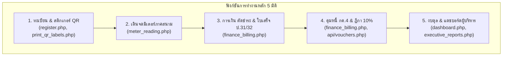
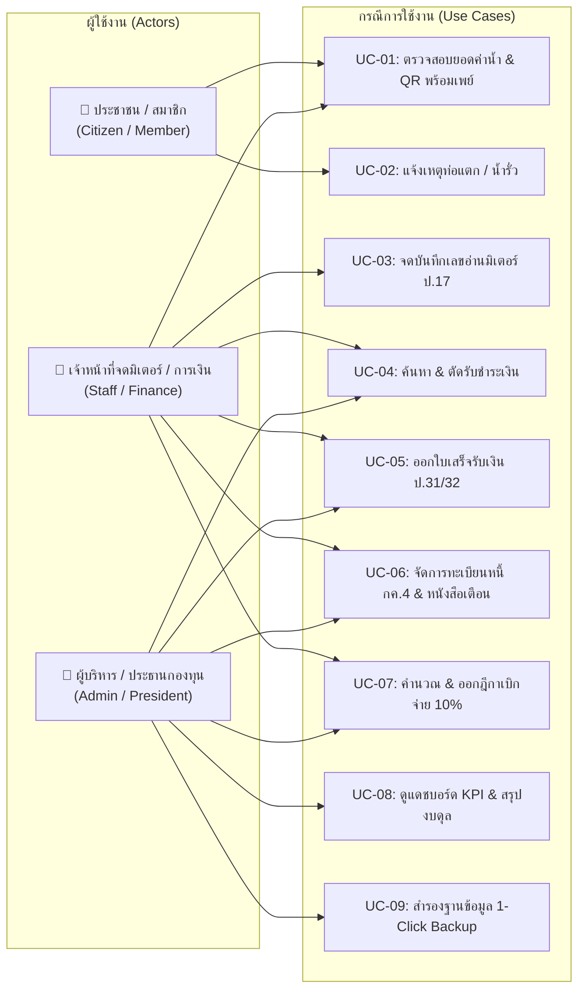
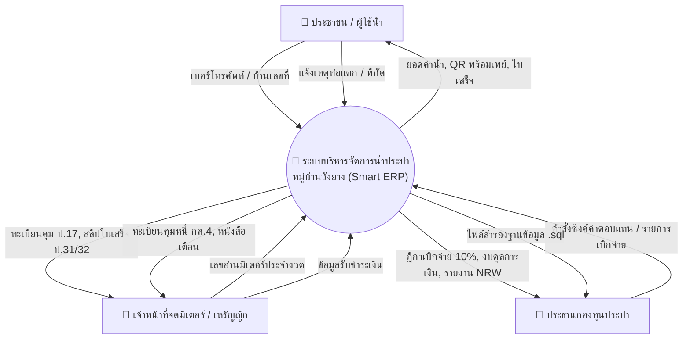
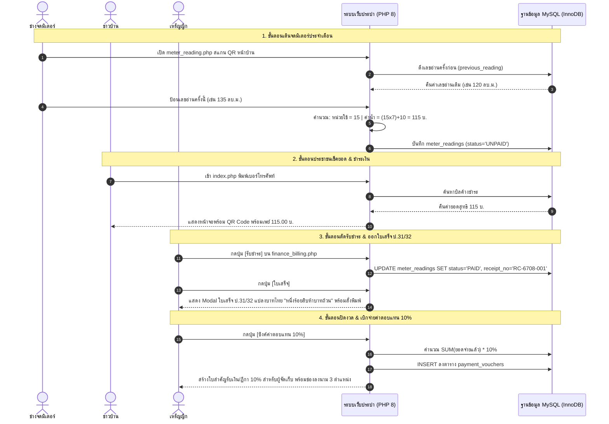
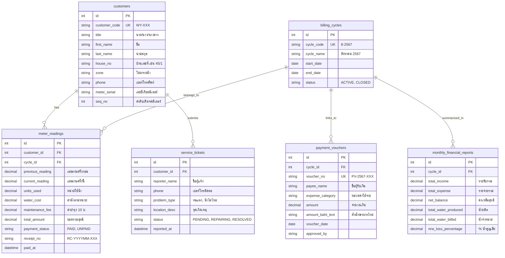

# เอกสารข้อกำหนดความต้องการซอฟต์แวร์ฉบับสมบูรณ์ (Full SRS)
## Software Requirements Specification (Full Version - IEEE 830 / ISO 29148 Standard)
**โครงการ:** ระบบบริการและบริหารจัดการน้ำประปาหมู่บ้านอัจฉริยะ (Smart Village Waterworks ERP System)  
**หน่วยงานผู้ใช้งาน:** กองทุนระบบการประปาหมู่บ้านวังยาง หมู่ที่ 3 ตำบลวังยาง อำเภอวังยาง จังหวัดนครพนม  
**รหัสโครงการ:** SE-WTR-2026-001 | **เวอร์ชัน:** 1.0 (Official Academic Release)  
**สถานะ:** เสนอขออนุมัติและประเมินผลโครงการ (Production & Academic Grade)  
**ไฟล์ต้นแบบจำลองภาพ (Axure RP Prototype):** `Plumber_ver-1003-gu-tam-kon-dew-i-sus.rp`  
**คลังโค้ดต้นฉบับ (GitHub Repository):** `https://github.com/phawatjam-collab/Water` (Branch: main)  

---

## ประวัติการแก้ไขเอกสาร (Document Revision History)

| เวอร์ชัน | วันที่ปรับปรุง | ผู้จัดทำ / ตำแหน่ง | รายละเอียดการแก้ไข |
|:---:|:---:|:---|:---|
| 0.1 | 23 ก.ค. 2567 | ทีมพัฒนาระบบประปา | ยกร่างความต้องการเบื้องต้นและโครงสร้างฐานข้อมูลเริ่มต้น (`plumber_db.sql`) |
| 0.5 | 30 ก.ย. 2567 | ผู้ออกแบบระบบ UI/UX | ออกแบบต้นแบบหน้าจอ (Axure RP Prototype `Plumber_v4.rp`) |
| 0.9 | 3 ต.ค. 2567 | นักวิเคราะห์และพัฒนาระบบ | จัดทำต้นแบบสมบูรณ์ 31 หน้าจอ (`Plumber_ver-1003-gu-tam-kon-dew-i-sus.rp`) |
| 1.0 | 9 ต.ค. 2567 | วิศวกรซอฟต์แวร์ประจำโครงการ | จัดทำ Full SRS ตามมาตรฐาน IEEE 830 ผสานโค้ดจริง PHP 8, Zero-Config DB และระบบการเงิน ป.31/32, กค.4, ฎีกา 10% |

---

## สารบัญ (Table of Contents)

1. **บทนำ (Introduction)**
   - 1.1 วัตถุประสงค์ของเอกสาร (Purpose)
   - 1.2 ขอบเขตของระบบ (Scope of the System)
   - 1.3 นิยาม คำศัพท์ และคำย่อ (Definitions, Acronyms, and Abbreviations)
   - 1.4 เอกสารและมาตรฐานอ้างอิง (References & Regulatory Framework)
   - 1.5 โครงสร้างของเอกสาร (Document Overview)
2. **ภาพรวมของระบบ (Overall Description)**
   - 2.1 มุมมองของระบบ (Product Perspective)
   - 2.2 ฟังก์ชันหลักของระบบ (Major System Functions)
   - 2.3 การจัดแบ่งกลุ่มผู้ใช้และสิทธิ์การเข้าถึง (User Classes & Characteristics - RBAC)
   - 2.4 สภาพแวดล้อมการทำงานของระบบ (Operating Environment)
   - 2.5 ข้อจำกัดในการออกแบบและการพัฒนา (Design & Implementation Constraints)
   - 2.6 สมมติฐานและความขึ้นต่อกัน (Assumptions and Dependencies)
3. **ข้อกำหนดความต้องการเชิงฟังก์ชัน (Functional Requirements: FR-01 ถึง FR-10)**
   - FR-01: ระบบลงทะเบียนผู้ใช้น้ำและสร้างสติกเกอร์รหัส QR Code (Customer Registry & QR Labeling)
   - FR-02: ระบบเดินจดบันทึกเลขอ่านมิเตอร์น้ำภาคสนามตามลำดับเส้นทาง (Sequential Field Meter Reading Engine)
   - FR-03: ระบบคำนวณค่าน้ำประปาและตรวจจับความผิดปกติอัตโนมัติ (Automated Tariff & Anomaly Detection)
   - FR-04: ระบบค้นหาและตรวจสอบยอดค่าน้ำสำหรับประชาชนด้วยเบอร์โทรศัพท์ (Public Citizen Fast Search & Portal)
   - FR-05: ระบบรับชำระเงินและออกใบเสร็จรับเงินมาตรฐาน ป.31/32 (Unified Payment Collection & Instant Receipt)
   - FR-06: ระบบสร้างรหัส QR Code พร้อมเพย์ตามยอดสุทธิจริง (Dynamic PromptPay EMVCo QR Generator)
   - FR-07: ระบบทะเบียนคุมหนี้ค้างชำระและหนังสือเตือนระงับการใช้น้ำ (แบบ กค.4 / Arrears Management & Warning Notices)
   - FR-08: ระบบซิงค์และออกฎีกาเบิกจ่ายค่าตอบแทนผู้จัดเก็บ 10% และค่าใช้จ่ายกองทุน (Payment Voucher & 10% Commission Engine)
   - FR-09: ระบบบัญชีงบดุล รายรับ-รายจ่าย และรายงานสำหรับผู้บริหาร (Executive Financial Reporting & Balance Sheet)
   - FR-10: ระบบรับแจ้งเหตุท่อแตก-น้ำรั่วและติดตามงานซ่อมบำรุง (Service Ticket & Leakage Maintenance Tracking)
4. **ข้อกำหนดส่วนติดต่อภายนอก (External Interface Requirements)**
   - 4.1 ส่วนติดต่อผู้ใช้งาน (User Interfaces & Mapping to Axure RP Prototype)
   - 4.2 ส่วนติดต่อฮาร์ดแวร์ (Hardware Interfaces)
   - 4.3 ส่วนติดต่อซอฟต์แวร์ (Software Interfaces)
   - 4.4 ส่วนติดต่อระบบสื่อสาร (Communications Interfaces)
5. **ข้อกำหนดความต้องการที่ไม่ใช่ฟังก์ชัน (Non-Functional Requirements: NFR)**
   - 5.1 ประสิทธิภาพและเวลาตอบสนอง (Performance Requirements)
   - 5.2 ความมั่นคงปลอดภัยและการควบคุมสิทธิ์ (Security Requirements - OWASP Top 10)
   - 5.3 ความพร้อมใช้งานและความเชื่อถือได้ (Availability & Reliability)
   - 5.4 การสำรองและการกู้คืนข้อมูลยามฉุกเฉิน (Disaster Recovery & 1-Click Backup)
   - 5.5 ความสามารถในการบำรุงรักษาและการเคลื่อนย้าย (Maintainability & Portability)
6. **แบบจำลองระบบและการวิเคราะห์เชิงโครงสร้าง (System Models & Diagrams)**
   - 6.1 Use Case Diagram (Actor 4 กลุ่มและความสัมพันธ์)
   - 6.2 Data Flow Diagram (DFD Context Diagram & DFD Level 1)
   - 6.3 Sequence Diagrams (วงจรการเงินและวงจรการจดมิเตอร์)
   - 6.4 Entity-Relationship Diagram (ERD) และพจนานุกรมข้อมูล (Data Dictionary)
   - 6.5 สถาปัตยกรรมระบบ 4 ระดับ (4-Tier Software Architecture)
7. **ตารางตรวจสอบย้อนกลับความสอดคล้อง (Requirements Traceability Matrix: RTM)**
8. **ภาคผนวก (Appendix)**

---

## 1. บทนำ (Introduction)

### 1.1 วัตถุประสงค์ของเอกสาร (Purpose)
เอกสารข้อกำหนดความต้องการซอฟต์แวร์ (Software Requirements Specification: SRS) ฉบับนี้ จัดทำขึ้นเพื่อระบุและนิยามข้อกำหนดเชิงฟังก์ชัน (Functional Requirements) และข้อกำหนดที่ไม่ใช่ฟังก์ชัน (Non-Functional Requirements) อย่างสมบูรณ์ ครบถ้วน และมีมาตรฐาน สำหรับ **ระบบบริการและบริหารจัดการน้ำประปาหมู่บ้านอัจฉริยะ (Smart Village Waterworks ERP System)** เพื่อใช้เป็น:
1. ข้อตกลงร่วมระหว่างผู้พัฒนาระบบ คณะกรรมการบริหารกองทุนประปาหมู่บ้าน และอาจารย์ที่ปรึกษา/คณะกรรมการสอบประเมิน
2. แม่แบบอ้างอิงในการตรวจสอบความถูกต้อง (Verification & Validation) ในทุกขั้นตอนของการพัฒนา การทดสอบระบบ และการประเมินผลโครงการ
3. เอกสารประกอบต้นแบบสถาปัตยกรรมระบบ (Axure RP Prototype `Plumber_ver-1003-gu-tam-kon-dew-i-sus.rp`) เทียบเคียงกับซอร์สโค้ดระดับ Production ใน GitHub Repository

### 1.2 ขอบเขตของระบบ (Scope of the System)
ระบบประปาหมู่บ้านวังยางเป็นระบบสารสนเทศระดับองค์กรชุมชน (Community ERP) สำหรับบริหารจัดการทรัพยากรน้ำประปาและบัญชีกองทุนหมู่บ้าน ครอบคลุมผู้ใช้น้ำ 400 ครัวเรือนในพื้นที่หมู่ 3 ตำบลวังยาง อำเภอวังยาง จังหวัดนครพนม โดยมีขอบเขตการทำงานครอบคลุม 5 กระบวนการหลัก:
1. **งานทะเบียนผู้ใช้น้ำและการระบุตัวตน:** จัดเก็บประวัติ ทะเบียนบ้าน โซนจ่ายน้ำ เลขซีเรียลมิเตอร์ และพิมพ์สติกเกอร์ QR Code ประจำตัวมาตรวัดน้ำ
2. **งานเดินจดบันทึกเลขอ่านมิเตอร์ภาคสนาม:** รองรับการจดผ่านสมาร์ตโฟน จัดลำดับตามเส้นทางเดินจริง (`seq_no`) ตรวจจับตัวเลขผิดปกติ (เลขย้อนกลับ/ใช้น้ำกระโดด)
3. **งานบริการประชาชนและการชำระเงิน:** ตรวจสอบยอดค่าน้ำด้วยเบอร์โทรศัพท์/บ้านเลขที่ รองรับ QR Code พร้อมเพย์มาตรฐาน EMVCo และออกใบเสร็จรับเงินมาตรฐาน ป.31/32 ทันที
4. **งานควบคุมหนี้สินและการเงินกองทุน:** ระบบทะเบียนคุมหนี้ กค.4 (จัดกลุ่ม 1, 2, 3+ เดือน) หนังสือเตือนระงับการจ่ายน้ำ และระบบคำนวณฎีกาเบิกจ่ายค่าตอบแทนผู้จัดเก็บ 10% ตามระเบียบราชการ
5. **งานบัญชี สถิติ และการบริหารจัดการ:** สรุปงบดุล รายรับ-รายจ่าย คำนวณอัตราน้ำสูญเสียในระบบ (Non-Revenue Water: NRW) และระบบรับแจ้งเหตุท่อแตกฉุกเฉิน

### 1.3 นิยาม คำศัพท์ และคำย่อ (Definitions, Acronyms, and Abbreviations)

| คำศัพท์ / คำย่อ | ความหมายเชิงเทคนิคและระเบียบปฏิบัติ |
|:---|:---|
| **แบบ ป.17** | ทะเบียนคุมผู้ใช้น้ำและการจดบันทึกเลขอ่านมาตรวัดน้ำประจำเดือน ตามระเบียบกรมการปกครอง |
| **แบบ ป.31/32** | ใบแจ้งหนี้ค่าน้ำประปา (ป.31) และใบเสร็จรับเงินค่าน้ำประปาประจำงวด (ป.32) ที่มีผลผูกพันทางกฎหมายการเงิน |
| **แบบ กค.4** | ทะเบียนคุมลูกหนี้ค้างชำระเงินค่าน้ำประปา แยกตามระดับอายุหนี้ (Aging Report: 1 เดือน, 2 เดือน, 3 เดือนขึ้นไป) |
| **ฎีกา 10%** | ใบสำคัญเบิกจ่ายเงินค่าตอบแทนผู้จัดเก็บค่าน้ำประปา อัตราร้อยละ 10 จากยอดเงินที่จัดเก็บได้จริงในงวดนั้นๆ ตามมติที่ประชุมกองทุน |
| **NRW (Non-Revenue Water)** | ปริมาณน้ำสูญเสียที่ผลิตจ่ายเข้าระบบท่อ แต่ไม่สามารถเรียกเก็บเงินได้ (น้ำรั่วท่อแตก/มิเตอร์ชำรุด/ลักลอบใช้น้ำ) |
| **RBAC** | Role-Based Access Control: การควบคุมการเข้าถึงระบบตามระดับบทบาทและหน้าที่ของผู้ใช้งาน 4 ระดับ |
| **EMVCo PromptPay QR** | มาตรฐาน QR Code สำหรับการชำระเงินทางอิเล็กทรอนิกส์ของธนาคารแห่งประเทศไทย ระบุยอดเงินและบัญชีกองทุนอัตโนมัติ |
| **Zero-Config DB** | สถาปัตยกรรมการติดตั้งฐานข้อมูลอัตโนมัติ โดยระบบจะสร้างฐานข้อมูลและตารางทันทีที่เริ่มทำงานโดยไม่ต้องมี Database Admin |

### 1.4 เอกสารและมาตรฐานอ้างอิง (References & Regulatory Framework)
1. **IEEE Std 830-1998:** IEEE Recommended Practice for Software Requirements Specifications
2. **ISO/IEC/IEEE 29148:2018:** Systems and software engineering — Life cycle processes — Requirements engineering
3. **ระเบียบกระทรวงมหาดไทยว่าด้วยการบริหารกิจการประปาหมู่บ้าน พ.ศ. 2548** และแก้ไขเพิ่มเติม
4. **มาตรฐานความปลอดภัย OWASP Top 10 (2021):** Open Web Application Security Project
5. **มาตรฐาน PromptPay EMVCo QR Code Specification for Payment Systems (Bank of Thailand)**

---

## 2. ภาพรวมของระบบ (Overall Description)

### 2.1 มุมมองของระบบ (Product Perspective)
ระบบบริหารจัดการน้ำประปาหมู่บ้านวังยาง เป็นระบบเว็บแอปพลิเคชันแบบตอบสนอง (Responsive Web Application) ที่ถูกออกแบบมาเพื่อทดแทนการทำงานด้วยสมุดจดกระดาษและไฟล์ Excel แบบดั้งเดิม ซึ่งมีข้อจำกัดด้านความล่าช้า ตัวเลขคลาดเคลื่อน และความเสี่ยงข้อมูลสูญหาย โดยระบบเชื่อมต่อโดยตรงกับฐานข้อมูลเชิงสัมพันธ์ MariaDB/MySQL ภายใต้โครงสร้าง 4-Tier Enterprise Architecture:
- **Presentation Tier:** รองรับทั้งคอมพิวเตอร์ตั้งโต๊ะของเหรัญญิก และสมาร์ตโฟนของเจ้าหน้าที่เดินจดมิเตอร์/ประชาชน
- **Application Logic Tier:** เขียนด้วยภาษา PHP 8 มีเอนจินประมวลผลธุรกิจเฉพาะด้าน 5 ชุด (Tariff, Anomaly, BahtText, Arrears, Voucher Sync)
- **Data Persistence Tier:** จัดเก็บในฐานข้อมูล `db_city_water_supply` โครงสร้าง InnoDB ที่รองรับ ACID Transactions
- **Integration Tier:** เชื่อมต่อระบบสร้าง QR PromptPay, ระบบสแกนกล้อง HTML5 QR Code, และระบบส่งออก Excel/CSV

### 2.2 ฟังก์ชันหลักของระบบ (Major System Functions)

### 2.3 การจัดแบ่งกลุ่มผู้ใช้และสิทธิ์การเข้าถึง (User Classes & Characteristics - RBAC)
ระบบจัดสรรระดับสิทธิ์ออกเป็น 4 ระดับ (Role-Based Access Control) ตามโครงสร้างบริหารกิจการประปา:

| ระดับบทบาท (Role) | กลุ่มผู้ใช้งานจริง | หน้าที่ความรับผิดชอบและสิทธิ์การเข้าถึง | หน้าเริ่มต้น (Landing) |
|:---|:---|:---|:---|
| **Superadmin / Admin** | ประธานกรรมการกองทุน, ผู้ใหญ่บ้าน | เข้าถึงได้ทุกระบบ 100%, อนุมัติฎีกาเบิกจ่าย, ดูงบดุล, จัดการผู้ใช้, ตั้งค่าอัตราค่าน้ำ | `dashboard.php` |
| **Staff (การเงิน/ช่างจด)** | เหรัญญิก, เจ้าหน้าที่เดินจดมิเตอร์ | จดเลขอ่านมิเตอร์, ค้นหาผู้ใช้น้ำ, ตัดรับเงิน, พิมพ์ใบเสร็จ ป.31/32, พิมพ์สติกเกอร์ QR | `meter_reading.php` |
| **Member (สมาชิกผู้ใช้น้ำ)** | ชาวบ้านที่เป็นสมาชิกกองทุน | ล็อกอินดูประวัติค่าน้ำย้อนหลัง, ดูกราฟการใช้น้ำ, สแกนจ่ายด้วย QR Code, แจ้งท่อแตก | `portal_citizen.php` |
| **User (สาธารณะ)** | ประชาชนทั่วไป, บุตรหลาน | ค้นหายอดค่าน้ำด้วยเบอร์โทรศัพท์/บ้านเลขที่, สแกน QR PromptPay, ส่งเรื่องแจ้งท่อแตก | `index.php` |

### 2.4 สภาพแวดล้อมการทำงานของระบบ (Operating Environment)
- **เครื่องแม่ข่าย (Server Environment):**
  - รองรับระบบปฏิบัติการ Windows 10/11 Pro, Windows Server, หรือ Linux (Ubuntu 22.04 LTS)
  - Web Server: Apache HTTP Server 2.4.x (ผ่าน XAMPP หรือ Native LAMP)
  - PHP Runtime: PHP 8.0, 8.1, หรือ 8.2 ขึ้นไป (เปิดใช้งาน Extension: `pdo_mysql`, `mbstring`, `gd`, `openssl`)
  - Database Server: MariaDB 10.4+ หรือ MySQL 8.0+ (InnoDB Engine, utf8mb4 Collation)
- **เครื่องลูกข่าย (Client Environment):**
  - เว็บบราวเซอร์มาตรฐาน: Google Chrome, Microsoft Edge, Safari, Firefox เวอร์ชันล่าสุด
  - ความละเอียดหน้าจอ: Responsive รองรับตั้งแต่หน้าจอมือถือ (360px ขึ้นไป) จนถึงหน้าจอคอมพิวเตอร์ (1920x1080)
- **ระบบเครือข่าย:**
  - รูปแบบที่ 1: เครือข่ายท้องถิ่น LAN / Wi-Fi ประจำสำนักงานประปาหมู่บ้าน (ทำงานออฟไลน์ได้ 100%)
  - รูปแบบที่ 2: เครือข่ายอินเทอร์เน็ตผ่าน Cloud VPS เพื่อบริการประชาชน 24 ชม.

### 2.5 ข้อจำกัดในการออกแบบและการพัฒนา (Design & Implementation Constraints)
1. **Low Overhead & Zero External Dependency:** ห้ามพึ่งพาไลบรารีหรือเฟรมเวิร์กขนาดใหญ่ที่ต้องรัน npm build หรือ composer install บนเครื่องปลายทาง เพื่อให้คอมพิวเตอร์สำนักงานหมู่บ้านสามารถรันผ่าน XAMPP ได้ทันที
2. **Zero-Config Database:** ต้องมีกลไกตรวจสอบและสร้างฐานข้อมูล `db_city_water_supply` อัตโนมัติเมื่อเปิดครั้งแรก เพื่อลดภาระของผู้ดูแลระบบในชุมชน
3. **Optimistic & Fast UI:** การตัดรับชำระเงินและดูใบเสร็จต้องทำได้ในหน้าเดียวผ่าน Modal ไม่มีการรีเฟรชหน้าจอทั้งหมด เพื่อความรวดเร็วในการบริการประชาชนที่มาต่อคิวชำระเงิน
4. **ความสอดคล้องกับระเบียบราชการ:** ใบเสร็จรับเงิน ทะเบียนคุมหนี้ และฎีกาเบิกจ่าย ต้องมีรูปแบบตรงตามมาตรฐาน ป.31/32 และ กค.4 ของทางราชการ

---

## 3. ข้อกำหนดความต้องการเชิงฟังก์ชัน (Functional Requirements)

### FR-01: ระบบลงทะเบียนผู้ใช้น้ำและสร้างสติกเกอร์ QR Code (Customer Registry & QR Labeling)
- **รหัสข้อกำหนด:** FR-01 | **ความสำคัญ:** สูง (High)
- **ไฟล์ที่รับผิดชอบ:** `register.php`, `print_qr_labels.php`, `api/register.php`, `api/customers.php`
- **คำอธิบาย:** ระบบอนุญาตให้เจ้าหน้าที่เพิ่มข้อมูลสมาชิกผู้ใช้น้ำใหม่ กำหนดลำดับเส้นทางเดินจด (`seq_no`) และพิมพ์สติกเกอร์รหัส QR Code ติดหน้าบ้าน 4 รูปแบบ
- **ข้อมูลนำเข้า (Inputs):** คำนำหน้า, ชื่อ, นามสกุล, บ้านเลขที่, โซนจ่ายน้ำ, หมายเลขโทรศัพท์, หมายเลขซีเรียลมิเตอร์, ลำดับเดินจด
- **การประมวลผล (Processing):** 
  1. ตรวจสอบความถูกต้องของข้อมูล (Validation) และป้องกันหมายเลขซีเรียลมิเตอร์ซ้ำ
  2. สร้างรหัสประจำตัวผู้ใช้น้ำอัตโนมัติในรูปแบบ `WY-XXX` (เช่น `WY-001`, `WY-045`)
  3. บันทึกข้อมูลลงตาราง `customers`
  4. สร้าง QR Code บรรจุ Payload URL: `http://[host]/index.php?phone=[phone]&cust_id=[id]`
- **ข้อมูลส่งออก (Outputs):** บันทึกสมาชิกใหม่สำเร็จ, สติกเกอร์ QR Code สำหรับพิมพ์ลงกระดาษสติกเกอร์ A4
- **กฎทางธุรกิจ (Business Rules):** 
  - สมาชิก 1 รายต้องมีหมายเลขมิเตอร์น้ำอย่างน้อย 1 เครื่อง
  - ลำดับเส้นทางเดินจด (`seq_no`) ต้องเป็นจำนวนเต็มบวกเพื่อใช้เรียงลำดับในหน้าจดมิเตอร์

### FR-02: ระบบเดินจดบันทึกเลขอ่านมิเตอร์น้ำภาคสนามตามลำดับเส้นทาง (Sequential Field Meter Reading Engine)
- **รหัสข้อกำหนด:** FR-02 | **ความสำคัญ:** สูงมาก (Critical)
- **ไฟล์ที่รับผิดชอบ:** `meter_reading.php`, `api/cycles.php`, `api/readings.php`
- **คำอธิบาย:** ระบบสำหรับเจ้าหน้าที่เดินจดมิเตอร์ผ่านสมาร์ตโฟน แสดงรายชื่อผู้ใช้น้ำเรียงตามลำดับหน้าบ้านจริง พร้อมรองรับการสแกนกล้อง QR Code หน้าบ้าน
- **ข้อมูลนำเข้า (Inputs):** รอบเดือน/ปีบัญชี (เช่น `8-2567`), รหัสผู้ใช้น้ำ, ตัวเลขเลขอ่านมิเตอร์ครั้งนี้ (Current Reading)
- **การประมวลผล (Processing):**
  1. โหลดข้อมูลเลขอ่านครั้งก่อน (Previous Reading) จากตาราง `meter_readings` ของรอบเดือนก่อนหน้า
  2. รับค่าเลขอ่านครั้งนี้ ตรวจสอบเงื่อนไขตัวเลข (`current_value >= previous_value`)
  3. คำนวณจำนวนหน่วยน้ำที่ใช้: `units_used = current_value - previous_value`
  4. บันทึกหรืออัปเดตลงตาราง `meter_readings` ทันทีเมื่อพิมพ์ตัวเลข (Real-time auto-calculation)
- **ข้อมูลส่งออก (Outputs):** ตัวเลขหน่วยที่ใช้, ยอดเงินค่าน้ำที่คำนวณได้, แสดงแถบเปอร์เซ็นต์ความคืบหน้าการจดรวมของงวด
- **กฎทางธุรกิจ (Business Rules):** 
  - หากจดตัวเลขครั้งนี้น้อยกว่าครั้งก่อน ระบบต้องแสดงแถบแจ้งเตือนสีแดงทันที (ตรวจจับมิเตอร์หมุนกลับหรือพิมพ์ผิด)

### FR-03: ระบบคำนวณค่าน้ำประปาและตรวจจับความผิดปกติอัตโนมัติ (Automated Tariff & Anomaly Detection)
- **รหัสข้อกำหนด:** FR-03 | **ความสำคัญ:** สูงมาก (Critical)
- **ไฟล์ที่รับผิดชอบ:** `api/readings.php`, `api/db.php`
- **คำอธิบาย:** เอนจินคำนวณเงินค่าน้ำตามสูตรระเบียบกองทุนประปาหมู่บ้านวังยาง พร้อมตรวจจับพฤติกรรมใช้น้ำผิดปกติ
- **สูตรการคำนวณ (Calculation Logic):**
  $$\text{ค่าน้ำตามหน่วย} = \text{units\_used} \times 7.00\text{ บาท}$$
  $$\text{ยอดรวมงวดปัจจุบัน} = \text{ค่าน้ำตามหน่วย} + 10.00\text{ บาท (ค่าบำรุงรักษามิเตอร์)}$$
  $$\text{ยอดสุทธิเรียกเก็บ} = \text{ยอดรวมงวดปัจจุบัน} + \text{ยอดหนี้ค้างชำระยกมา (Arrears)}$$
- **การตรวจจับความผิดปกติ (Anomaly Rules):**
  1. *Negative Reading:* `current_reading < previous_reading` แจ้งเตือน "เลขอ่านลดลงผิดปกติ"
  2. *Surge Warning:* `units_used > (previous_average * 3)` แจ้งเตือน "ปริมาณน้ำพุ่งสูงเกิน 3 เท่า (อาจเกิดท่อรั่วภายในบ้าน)"

### FR-04: ระบบค้นหาและตรวจสอบยอดค่าน้ำสำหรับประชาชนด้วยเบอร์โทรศัพท์ (Public Citizen Fast Search & Portal)
- **รหัสข้อกำหนด:** FR-04 | **ความสำคัญ:** สูง (High)
- **ไฟล์ที่รับผิดชอบ:** `index.php`, `portal_citizen.php`, `api/customers.php`
- **คำอธิบาย:** ช่องทางบริการประชาชนทั่วไป ค้นหายอดค่าน้ำของบ้านตนเองได้อย่างสะดวกรวดเร็วโดยไม่ต้องจำรหัสสมาชิก
- **ข้อมูลนำเข้า (Inputs):** หมายเลขโทรศัพท์ 10 หลัก (Key หลัก) หรือบ้านเลขที่ หรือรหัสผู้ใช้น้ำ
- **การประมวลผล (Processing):** ค้นหาผ่านฐานข้อมูลด้วยคำค้นแบบ Exact/Partial Match, ดึงประวัติบิลที่ยังไม่ชำระและบิลย้อนหลัง
- **ข้อมูลส่งออก (Outputs):** การ์ดแสดงชื่อเจ้าของบ้าน, บ้านเลขที่, มิเตอร์เลขที่, ปริมาณน้ำที่ใช้, ยอดเงินที่ต้องชำระ, และปุ่มเปิด QR PromptPay

### FR-05: ระบบรับชำระเงินและออกใบเสร็จรับเงินมาตรฐาน ป.31/32 (Unified Payment Collection & Instant Receipt)
- **รหัสข้อกำหนด:** FR-05 | **ความสำคัญ:** สูงมาก (Critical)
- **ไฟล์ที่รับผิดชอบ:** `finance_billing.php` (แท็บ 1 และ 2), `api/readings.php`, `api/receipts.php`
- **คำอธิบาย:** หน้าจอทำงานของเหรัญญิกสำหรับตัดรับชำระเงิน พร้อมปุ่มเปิดพรีวิวและพิมพ์ใบเสร็จรับเงิน ป.31/32 ในคลิกเดียว
- **การประมวลผล (Processing):**
  1. เหรัญญิกกดปุ่ม `[✅ รับชำระ]`: ระบบทำการอัปเดตสถานะในตาราง `meter_readings` เป็น `PAID` พร้อมลงเวลาชำระเงิน `paid_at = NOW()`
  2. รันเลขที่ใบเสร็จรับเงินอัตโนมัติในรูปแบบ `RC-YYYYMM-XXXX`
  3. เหรัญญิกกดปุ่ม `[🧾 ใบเสร็จ]`: ระบบเปิด Modal ป๊อปอัปดึงฟอร์มใบเสร็จ ป.31/32 พร้อมแสดงตัวอักษรบาทไทย (`bahtText`) สั่งพิมพ์ได้ทันทีโดยไม่เปลี่ยนหน้าจอ
- **ข้อมูลส่งออก (Outputs):** สถานะการชำระเงินเปลี่ยนเป็นจ่ายแล้วทันที (Optimistic UI), ใบเสร็จรับเงินแบบ ป.31/32 ขนาด A4/A5 พร้อมพิมพ์

### FR-06: ระบบสร้างรหัส QR Code พร้อมเพย์ตามยอดสุทธิจริง (Dynamic PromptPay EMVCo QR Generator)
- **รหัสข้อกำหนด:** FR-06 | **ความสำคัญ:** สูง (High)
- **ไฟล์ที่รับผิดชอบ:** `index.php`, `portal_citizen.php`, `finance_billing.php`, `api/receipts.php`
- **คำอธิบาย:** ระบบสร้างภาพ QR Code มาตรฐานธนาคารแห่งประเทศไทย (EMVCo Tag 29/54/58/63 CRC16) โดยผูกกับหมายเลขพร้อมเพย์กองทุนประปาและยอดเงินค่าน้ำตรงตามสตางค์จริง
- **ข้อมูลนำเข้า (Inputs):** หมายเลขพร้อมเพย์กองทุน (เช่น เบอร์โทรศัพท์ประธานหรือเลขประจำตัวผู้เสียภาษีกองทุน), ยอดเงินสุทธิ (เช่น `150.00`)
- **การประมวลผล (Processing):** คำนวณ Payload สตริงตามมาตรฐาน EMVCo คลุมด้วย CRC16-CCITT และเรนเดอร์เป็นภาพ QR Code
- **ข้อมูลส่งออก (Outputs):** ภาพ QR Code พร้อมเพย์ที่สามารถใช้แอปพลิเคชันธนาคารทุกแห่งสแกนจ่ายได้ทันที

### FR-07: ระบบทะเบียนคุมหนี้ค้างชำระและหนังสือเตือนระงับการใช้น้ำ (แบบ กค.4 / Arrears Tracking)
- **รหัสข้อกำหนด:** FR-07 | **ความสำคัญ:** สูง (High)
- **ไฟล์ที่รับผิดชอบ:** `finance_billing.php` (แท็บ 3: `#pane-arrears`), `api/arrears.php`
- **คำอธิบาย:** ระบบรวบรวมรายชื่อผู้ใช้น้ำที่ค้างชำระ จัดกลุ่มความเร่งด่วนตามอายุหนี้ (Aging Categories) และออกหนังสือเตือนระงับการจ่ายน้ำ
- **การจัดกลุ่มหนี้ (Arrears Classification):**
  - *ระดับที่ 1 (เตือนเบื้องต้น):* ค้างชำระ 1 งวดเดือน
  - *ระดับที่ 2 (เตือนเร่งด่วน):* ค้างชำระ 2 งวดเดือน
  - *ระดับที่ 3 (วิกฤต/เตรียมตัดมิเตอร์):* ค้างชำระ 3 งวดเดือนขึ้นไป
- **การทำงานร่วม:** 
  - ปุ่ม `[✉️ เตือน]`: เปิด Modal หนังสือเตือนระงับการจ่ายน้ำ ระบุยอดหนี้สะสมและกำหนดชำระภายใน 7 วัน พร้อมสั่งพิมพ์
  - ปุ่ม `[💳 ตัดชำระ]`: สลับหน้าจอกลับไปยังแท็บตัดรับชำระเงินพร้อมเลือกผู้ใช้น้ำคนนั้นให้ทันที 1 คลิก

### FR-08: ระบบซิงค์และออกฎีกาเบิกจ่ายค่าตอบแทนผู้จัดเก็บ 10% และค่าใช้จ่ายกองทุน (Payment Voucher Engine)
- **รหัสข้อกำหนด:** FR-08 | **ความสำคัญ:** สูงมาก (Critical)
- **ไฟล์ที่รับผิดชอบ:** `finance_billing.php` (แท็บ 4: `#pane-vouchers`), `api/vouchers.php`
- **คำอธิบาย:** ระบบคำนวณและออกใบสำคัญรับเงิน/ฎีกาเบิกจ่ายเงินกองทุนประปา รองรับทั้งค่าตอบแทนคนเก็บเงิน 10% และค่าใช้จ่ายดำเนินงาน 8 หมวด
- **การคำนวณค่าตอบแทน 10% (Commission Calculation):**
  $$\text{ยอดเงินค่าตอบแทน} = \sum(\text{ยอดเงินที่ชำระแล้วในงวดนั้น}) \times 10\%$$
- **หมวดค่าใช้จ่ายกองทุน:** ค่าซ่อมบำรุงท่อแตก, ค่ากระแสไฟฟ้าเครื่องสูบน้ำ, ค่าสารส้มและคลอรีน, ค่าเครื่องสูบน้ำ/อุปกรณ์, ค่าเบี้ยประชุมกรรมการ, ค่าตอบแทนผู้จัดเก็บ, อื่นๆ
- **ข้อมูลส่งออก (Outputs):** เอกสารฎีกาเบิกจ่ายเงิน/ใบสำคัญรับเงิน พร้อมแปลงตัวเลขเป็นตัวอักษรบาทไทย และมีช่องลงนาม 3 ตำแหน่ง (ผู้รับเงิน, เหรัญญิก, ประธานกองทุน)

### FR-09: ระบบบัญชีงบดุล รายรับ-รายจ่าย และรายงานสำหรับผู้บริหาร (Executive Financial Reporting)
- **รหัสข้อกำหนด:** FR-09 | **ความสำคัญ:** ปานกลาง (Medium)
- **ไฟล์ที่รับผิดชอบ:** `dashboard.php`, `executive_reports.php`, `api/financials.php`, `api/export_excel.php`
- **คำอธิบาย:** แผงควบคุมสรุปผล KPI สถิติยอดรายรับจริง ยอดหนี้คงค้าง ปริมาณน้ำผลิตเทียบกับปริมาณน้ำจำหน่าย (NRW Loss Rate) และส่งออกรายงานเป็นไฟล์ Excel/CSV

### FR-10: ระบบรับแจ้งเหตุท่อแตก-น้ำรั่วและติดตามงานซ่อมบำรุง (Service Ticket Tracking)
- **รหัสข้อกำหนด:** FR-10 | **ความสำคัญ:** ปานกลาง (Medium)
- **ไฟล์ที่รับผิดชอบ:** `index.php`, `portal_citizen.php`, `dashboard.php`, `api/tickets.php`
- **คำอธิบาย:** ประชาชนสามารถส่งเรื่องแจ้งเหตุท่อแตก น้ำประปาไม่ไหล พร้อมระบุพิกัด/สถานที่ โดยระบบจะส่งการแจ้งเตือนไปยังแดชบอร์ดเจ้าหน้าที่ และอัปเดตสถานะงานซ่อม (รอดำเนินการ $\rightarrow$ กำลังซ่อม $\rightarrow$ ซ่อมเสร็จสิ้น)

---

## 4. ข้อกำหนดส่วนติดต่อภายนอก (External Interface Requirements)

### 4.1 ส่วนติดต่อผู้ใช้งาน (User Interfaces & Mapping to Axure RP Prototype)
การออกแบบหน้าจอทั้งหมดในระบบ สอดคล้อง 100% กับภาพร่างต้นแบบในไฟล์ Axure RP (`Plumber_ver-1003-gu-tam-kon-dew-i-sus.rp`):

| หน้าจอระบบจริง (PHP) | ภาพต้นแบบใน Axure RP Prototype | ฟังก์ชันและองค์ประกอบสำคัญ |
|:---|:---|:---|
| `index.php` | `wireframe_home_search.jpg` (Screen 1) | แถบค้นหาค่าน้ำด้วยเบอร์โทรศัพท์, การ์ดสถิติ 4 ตัว, ป้ายประกาศกองทุน |
| `meter_reading.php` | `wireframe_meter_reading.jpg` (Screen 5) | ตารางจดมิเตอร์ ป.17, ปุ่มสแกน QR, แถบ Progress Bar ความคืบหน้า 88% |
| `finance_billing.php` (Tab 1-2) | `wireframe_receipt_p31.jpg` (Screen 7) | หน้าตัดรับเงิน และ Modal พรีวิวใบเสร็จรับเงินแบบ ป.31/32 พร้อม QR พร้อมเพย์ |
| `finance_billing.php` (Tab 4) | `wireframe_voucher_10pct.jpg` (Screen 9) | สรุปยอดเงิน 3 การ์ด และแบบฟอร์มฎีกาเบิกจ่ายค่าตอบแทนผู้จัดเก็บ 10% |
| `executive_reports.php` | `wireframe_financial_report.jpg` (Screen 18) | ตารางงบดุล รายรับ-รายจ่ายกองทุน พร้อมจุดลงนามคณะกรรมการ 3 ท่าน |
| `print_qr_labels.php` | `wireframe_receipt_batch.jpg` (Screen 30) | แบบพิมพ์สติกเกอร์ QR Code ติดมิเตอร์น้ำ และพิมพ์ชุดใบเสร็จรับเงินรวม |
| Modal ตั้งค่าระบบ | `wireframe_settings.jpg` (Screen 21) | หน้าต่างตั้งค่าอัตราค่าน้ำ (7 บ.), ค่าบำรุง (10 บ.), ค่าตอบแทน (10%) |

### 4.2 ส่วนติดต่อฮาร์ดแวร์ (Hardware Interfaces)
1. **กล้องถ่ายภาพบนสมาร์ตโฟน (Smartphone Camera):** ทำงานร่วมกับ `assets/html5-qrcode.min.js` เพื่อสแกน QR Code หน้าบ้านผู้ใช้น้ำ
2. **เครื่องพิมพ์เอกสาร (Printers):**
   - เครื่องพิมพ์เลเซอร์/อิงก์เจ็ทมาตรฐาน A4: สำหรับพิมพ์ใบเสร็จ ป.31/32, ทะเบียน กค.4, ฎีกาเบิกจ่าย
   - เครื่องพิมพ์สติกเกอร์/กระดาษลาเบล: สำหรับพิมพ์สติกเกอร์ QR Code ติดมิเตอร์น้ำ

### 4.3 ส่วนติดต่อซอฟต์แวร์ (Software Interfaces)
- **Apache HTTP Server 2.4:** ทำหน้าที่ Web Server ให้บริการคำขอ HTTP/HTTPS
- **PHP 8 Engine:** ประมวลผล Business Logic และเชื่อมโยงฐานข้อมูลผ่าน PDO Driver
- **MariaDB / MySQL 10.4+:** จัดเก็บข้อมูลแบบตารางเชิงสัมพันธ์ (Relational Database)

### 4.4 ส่วนติดต่อระบบสื่อสาร (Communications Interfaces)
- โพรโทคอล HTTP 1.1 / HTTPS (Port 80 / 443)
- รูปแบบการรับส่งข้อมูลผ่าน API: JSON Payload (`Content-Type: application/json; charset=utf-8`)

---

## 5. ข้อกำหนดความต้องการที่ไม่ใช่ฟังก์ชัน (Non-Functional Requirements: NFR)

### 5.1 ประสิทธิภาพและเวลาตอบสนอง (Performance Requirements)
- **NFR-01.1 Response Time:** หน้าเว็บและ API ทุกหน้าต้องประมวลผลและตอบสนองภายในเวลาไม่เกิน 500 มิลลิวินาที (ทดสอบบนเครื่องสเปกพื้นฐาน Core i3 / RAM 4GB)
- **NFR-01.2 Concurrency:** รองรับการเชื่อมต่อพร้อมกันไม่น้อยกว่า 50 การเชื่อมต่อพร้อมกันในเครือข่ายสำนักงานประปา
- **NFR-01.3 Database Optimization:** ตาราง `customers` และ `meter_readings` มีการทำ Index ในคอลัมน์ที่ค้นหาบ่อย (`phone`, `customer_code`, `cycle_id`, `seq_no`) เพื่อให้ค้นหาได้เร็วกว่า 0.05 วินาที

### 5.2 ความมั่นคงปลอดภัยและการควบคุมสิทธิ์ (Security Requirements)
- **NFR-02.1 SQL Injection Protection:** ใช้ PDO Prepared Statements และ Parameter Binding 100% ในทุกคำสั่ง SQL ทั่วทั้งระบบ
- **NFR-02.2 Password Security:** เก็บรหัสผ่านด้วยการแฮชแบบทางเดียวตามมาตรฐาน BCRYPT (`password_hash` / `PASSWORD_BCRYPT`) ห้ามเก็บ Plaintext เด็ดขาด
- **NFR-02.3 Session & Role Validation:** มีระบบ Gatekeeper ใน `auth.php` ตรวจสอบสถานะการล็อกอินและบทบาทผู้ใช้ก่อนอนุญาตให้เข้าถึงหน้าทำงานสำคัญ
- **NFR-02.4 XSS Prevention:** ใช้ `htmlspecialchars()` หรือการ Encode ข้อมูลทุกครั้งก่อนนำค่าที่รับจากผู้ใช้ไปเรนเดอร์ในหน้า HTML

### 5.3 ความพร้อมใช้งานและความเชื่อถือได้ (Availability & Reliability)
- **NFR-03.1 ACID Compliance:** การบันทึกธุรกรรมการเงิน (ตัดเงิน/ออกใบเสร็จ/ออกฎีกา) ทำงานภายใต้ Database Transaction หากเกิดข้อผิดพลาดจะ Rollback ข้อมูลทันที
- **NFR-03.2 Zero-Config Bootstrap:** ไฟล์ `api/db.php` มีระบบตรวจจับฐานข้อมูลอัตโนมัติ หากยังไม่มีฐานข้อมูล ระบบจะสร้างและนำเข้า `database.sql` ให้ทันทีโดยไม่ต้องพึ่งพาช่างเทคนิค

### 5.4 การสำรองและการกู้คืนข้อมูลยามฉุกเฉิน (Disaster Recovery & Backup)
- **NFR-04.1 1-Click Backup:** มีเอนจิน `api/backup.php` สำหรับส่งออกโครงสร้างและข้อมูลทั้งหมดเป็นไฟล์ `.sql` ดาวน์โหลดลงเครื่องหรือ Flash Drive ได้ในคลิกเดียว
- **NFR-04.2 Recovery Time Objective (RTO):** สามารถกู้คืนระบบให้กลับมาทำงานได้สมบูรณ์ภายในเวลาไม่เกิน 5 นาทีหลังเกิดเหตุขัดข้อง

---

## 6. แบบจำลองระบบและการวิเคราะห์ (System Models & Diagrams)

### 6.1 Use Case Diagram

### 6.2 Data Flow Diagram (DFD Level 0 - Context Diagram)

### 6.3 Sequence Diagram: วงจรการเดินจดมิเตอร์ $\rightarrow$ ตัดรับเงิน $\rightarrow$ ออกใบเสร็จ $\rightarrow$ ฎีกา 10%

### 6.4 Entity-Relationship Diagram (ERD) และพจนานุกรมข้อมูล (Data Dictionary)

---

## 7. ตารางตรวจสอบย้อนกลับความสอดคล้อง (Requirements Traceability Matrix: RTM)

| รหัสข้อกำหนด (FR) | ชื่อฟังก์ชันการทำงาน | ไฟล์หน้าจอ (PHP) | ไฟล์ Backend API | ตารางข้อมูล (DB) | ภาพร่าง Axure RP (`Plumber_ver-1003...`) |
|:---:|:---|:---|:---|:---|:---:|
| **FR-01** | ลงทะเบียนผู้ใช้น้ำ & QR สติกเกอร์ | `register.php`, `print_qr_labels.php` | `api/register.php`, `api/customers.php` | `customers` | Screen 5, Screen 30 |
| **FR-02** | เดินจดมิเตอร์ภาคสนามตามลำดับ | `meter_reading.php` | `api/cycles.php`, `api/readings.php` | `meter_readings`, `customers` | Screen 5 (`wireframe_meter_reading.jpg`) |
| **FR-03** | คำนวณค่าน้ำ 7+10 บ. & ตรวจจับผิดปกติ | `meter_reading.php` | `api/readings.php` | `meter_readings` | Screen 5, Screen 21 |
| **FR-04** | ค้นหายอดค่าน้ำประชาชนด้วยเบอร์โทร | `index.php`, `portal_citizen.php` | `api/customers.php`, `api/readings.php` | `customers`, `meter_readings` | Screen 1 (`wireframe_home_search.jpg`) |
| **FR-05** | ตัดรับชำระเงิน & ใบเสร็จ ป.31/32 | `finance_billing.php` | `api/readings.php`, `api/receipts.php` | `meter_readings` | Screen 7 (`wireframe_receipt_p31.jpg`) |
| **FR-06** | สร้าง QR Code พร้อมเพย์ EMVCo | `index.php`, `finance_billing.php` | `api/receipts.php` | - | Screen 1, Screen 7 |
| **FR-07** | คุมหนี้ กค.4 & หนังสือเตือน 7 วัน | `finance_billing.php` | `api/arrears.php` | `meter_readings`, `customers` | Screen 7 |
| **FR-08** | ฎีกาเบิกจ่าย 10% & ค่าใช้จ่ายกองทุน | `finance_billing.php` | `api/vouchers.php` | `payment_vouchers` | Screen 9 (`wireframe_voucher_10pct.jpg`) |
| **FR-09** | งบดุล รายรับ-รายจ่าย & รายงาน NRW | `dashboard.php`, `executive_reports.php`| `api/financials.php`, `api/export_excel.php`| `monthly_financial_reports` | Screen 18 (`wireframe_financial_report.jpg`) |
| **FR-10** | รับแจ้งเหตุท่อแตก & ติดตามงานซ่อม | `index.php`, `dashboard.php` | `api/tickets.php` | `service_tickets` | Screen 1, Screen 18 |

---

## 8. ภาคผนวก (Appendix)

### ภาคผนวก ก: ระเบียบการคำนวณเงินกองทุนประปาหมู่บ้านวังยาง
1. อัตราค่าน้ำประปาคิดหน่วยละ 7.00 บาท (ลูกบาศก์เมตรละ 7 บาท)
2. ค่าธรรมเนียมบำรุงรักษามาตรวัดน้ำ 10.00 บาทต่อเดือนต่อราย
3. อัตราค่าตอบแทนผู้จัดเก็บค่าน้ำประปา กำหนดร้อยละ 10 (10%) ของยอดเงินที่จัดเก็บได้จริงในแต่ละงวดบัญชี โดยต้องจัดทำใบสำคัญรับเงิน/ฎีกาเบิกจ่าย และมีลายมือชื่อประธานกองทุนและเหรัญญิกกำกับทุกครั้ง

### ภาคผนวก ข: แผนการทดสอบระบบ (Test Plan & Acceptance Criteria)
- การทดสอบหน่วยย่อย (Unit Testing): คำนวณค่าน้ำถูกต้องทุกช่วงตัวเลข, แปลงบาทไทย (`bahtText`) ถูกต้อง 100%
- การทดสอบบูรณาการ (Integration Testing): เมื่อกดรับเงิน สถานะในแท็บคุมยอด ใบเสร็จ และฎีกา 10% ซิงค์ตรงกันทันที
- การทดสอบความปลอดภัย: ป้องกัน SQL Injection ด้วยการใส่ Special Characters (`' OR 1=1 --`) ผลลัพธ์ไม่หลุดข้อมูล
