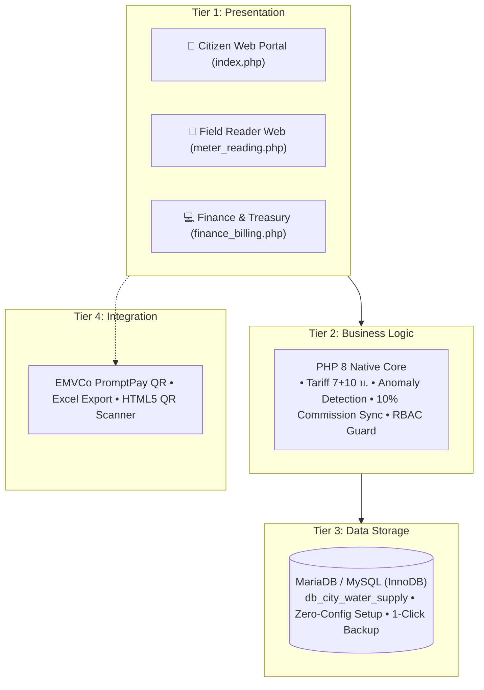

# เอกสารข้อกำหนดความต้องการซอฟต์แวร์ฉบับย่อ (Mini SRS)
## Mini Software Requirements Specification (Executive Summary Version)
**โครงการ:** ระบบบริการและบริหารจัดการน้ำประปาหมู่บ้านอัจฉริยะ (Smart Village Waterworks ERP System)  
**หน่วยงานผู้ใช้งาน:** กองทุนระบบการประปาหมู่บ้านวังยาง หมู่ที่ 3 ตำบลวังยาง อำเภอวังยาง จังหวัดนครพนม  
**รหัสโครงการ:** SE-WTR-2026-MINI | **เวอร์ชัน:** 1.0 (Executive Quick Review)  
**อ้างอิงภาพร่าง Axure RP:** `Plumber_ver-1003-gu-tam-kon-dew-i-sus.rp`  
**คลังโค้ด GitHub:** `https://github.com/phawatjam-collab/Water`  

---

## 1. บทสรุปผู้บริหารและที่มาของโครงการ (Executive Summary)

### 1.1 สภาพปัญหาเดิม (Problem Statement)
กิจการประปาหมู่บ้านชนบทส่วนใหญ่ยังบันทึกด้วยสมุดกระดาษและเอ็กเซล ทำให้เกิดปัญหา:
1. การจดเลขมิเตอร์คลาดเคลื่อน เลขถอยหลัง และยอดใช้น้ำกระโดดไม่ได้รับการตรวจสอบทันที
2. การออกบิลล่าช้า ประชาชนไม่ทราบยอดค้างจนเกิดหนี้สะสมเรื้อรัง
3. การหักค่าตอบแทนผู้จัดเก็บ 10% ขาดเอกสารใบสำคัญรับเงินที่ตรวจสอบย้อนหลังได้ชัดเจน

### 1.2 โซลูชันที่นำเสนอ (Proposed Solution)
พัฒนาระบบ ERP ชุมชนบนเว็บแบบ Responsive Web (PHP 8 + MySQL InnoDB) บูรณาการ 5 มิติ:
- **จดมิเตอร์ ป.17:** จดผ่านมือถือตามเส้นทางจริง ตรวจจับเลขย้อนกลับอัตโนมัติ
- **บริการประชาชน:** เช็คยอดด้วยเบอร์โทร สแกนพร้อมเพย์ QR Code มาตรฐาน EMVCo
- **การเงิน ป.31/32:** ตัดรับเงิน Optimistic UI พิมพ์ใบเสร็จในคลิกเดียว
- **คุมหนี้ กค.4:** แยกอายุหนี้ 1/2/3+ เดือน และพิมพ์หนังสือเตือน 7 วัน
- **ฎีกา 10%:** คำนวณค่าตอบแทนจากยอดจ่ายจริงอัตโนมัติ พร้อมใบสำคัญรับเงิน 3 ลายเซ็น

---

## 2. ตารางผู้ใช้งานและสิทธิ์ (User Role Matrix)

| บทบาท (Role) | ผู้ใช้งานหลัก | ขอบเขตสิทธิ์ | หน้าทำงานหลัก |
|:---|:---|:---|:---|
| **Superadmin** | ประธานกองทุน / ผู้ใหญ่บ้าน | เข้าถึงได้ทุกระบบ 100%, อนุมัติฎีกา, ปรับอัตราค่าน้ำ, สำรอง DB | `dashboard.php` |
| **Staff** | เหรัญญิก / ช่างจดมิเตอร์ | จดมิเตอร์ ป.17, ตัดเงิน, พิมพ์ใบเสร็จ ป.31/32, คุมหนี้ กค.4 | `meter_reading.php` |
| **Member** | สมาชิกผู้ใช้น้ำ | ดูกราฟย้อนหลัง, สแกนจ่ายพร้อมเพย์, แจ้งท่อแตก | `portal_citizen.php` |
| **User** | ประชาชนทั่วไป | ค้นหายอดด้วยเบอร์โทรศัพท์/บ้านเลขที่, สแกนจ่าย | `index.php` |

---

## 3. สรุป 10 ข้อกำหนดเชิงฟังก์ชัน (Summary of 10 Functional Requirements)

| รหัส | ชื่อฟังก์ชัน | อินพุตหลัก | เอาต์พุต / ผลลัพธ์ | ไฟล์ระบบ (PHP) |
|:---:|:---|:---|:---|:---|
| **FR-01** | ทะเบียนผู้ใช้น้ำ & QR สติกเกอร์ | ข้อมูลสมาชิก, ซีเรียลมิเตอร์, `seq_no` | รหัส `WY-xxx`, สติกเกอร์ QR ติดหน้าบ้าน | `register.php`, `print_qr_labels.php` |
| **FR-02** | เดินจดมิเตอร์ภาคสนาม ป.17 | งวดเดือน, เลขอ่านครั้งนี้ | หน่วยใช้น้ำ, แถบความคืบหน้า 88% | `meter_reading.php` |
| **FR-03** | เอนจินคำนวณค่าน้ำ 7+10 บ. | เลขอ่านเดิม-ใหม่ | ค่าน้ำ = (หน่วย x 7)+10+หนี้เก่า แจ้งเตือนเลขติดลบ | `api/readings.php` |
| **FR-04** | ค้นหายอดประชาชนด้วยเบอร์โทร | เบอร์โทรศัพท์ 10 หลัก | บิลค่าน้ำค้างชำระ, ปุ่มเปิด QR พร้อมเพย์ | `index.php`, `portal_citizen.php` |
| **FR-05** | ตัดรับชำระ & ใบเสร็จ ป.31/32 | รหัสผู้ใช้น้ำ, งวด | สถานะ PAID, ใบเสร็จ ป.31/32 แปลงบาทไทย | `finance_billing.php` |
| **FR-06** | สร้าง QR Code พร้อมเพย์ EMVCo | ยอดเงินสุทธิ, รหัสกองทุน | QR Code สแกนผ่านทุกโมบายแบงก์กิง | `api/receipts.php` |
| **FR-07** | คุมหนี้ กค.4 & หนังสือเตือน 7 วัน | ตัวกรองงวดค้างชำระ | หนังสือเตือนระงับการจ่ายน้ำ, ปุ่มกระโดดตัดเงิน | `finance_billing.php` (Tab 3) |
| **FR-08** | ฎีกาเบิกจ่าย 10% & ค่าใช้จ่ายกองทุน | ยอดเงินชำระแล้วงวดนั้น | ฎีกาค่าตอบแทน 10%, ใบสำคัญ 8 หมวดค่าใช้จ่าย | `finance_billing.php` (Tab 4) |
| **FR-09** | งบดุล รายรับ-รายจ่าย & NRW | ข้อมูลสรุปประจำเดือน | งบดุลกองทุน 3 ลายเซ็น, ส่งออก Excel | `dashboard.php`, `executive_reports.php` |
| **FR-10** | รับแจ้งท่อแตก & ติดตามงานซ่อม | รายละเอียดจุดเกิดเหตุ | รายการแจ้งเตือนช่าง, อัปเดตสถานะงานซ่อม | `index.php`, `api/tickets.php` |

---

## 4. สถาปัตยกรรม 4 ระดับและโมเดลการติดตั้ง (Architecture & Deployment)

- **โมเดลที่ 1 (Local On-Premise LAN):** ติดตั้งบน PC สำนักงานประปาหมู่บ้าน กระจาย Wi-Fi ภายใน ออฟไลน์ 100% ไม่เสียค่าใช้จ่าย
- **โมเดลที่ 2 (Cloud VPS Hosting):** ติดตั้งบนคลาวด์ ~200 บ./ด. พร้อม SSL HTTPS ประชาชนตรวจค่าน้ำและแจ้งเหตุได้ 24 ชม.

---

## 5. ผลการตรวจสอบความถูกต้อง (Verification & Production Checklist)

- [x] ตรวจสอบ Syntax Error ภาษา PHP ทุกไฟล์ (25 ไฟล์) ผ่าน 100%
- [x] ระบบ Zero-Config Auto-Setup สร้างฐานข้อมูลและตารางอัตโนมัติเมื่อเปิดครั้งแรก
- [x] ป้องกัน SQL Injection ด้วย PDO Prepared Statements 100%
- [x] ระบบสำรองข้อมูลฉุกเฉิน 1-Click Backup (`api/backup.php`) ใช้งานได้สมบูรณ์
- [x] หน้าจอระบบจริงสอดคล้องกับ Axure RP Prototype (`Plumber_ver-1003-gu-tam-kon-dew-i-sus.rp`) ครบทั้ง 31 หน้าจอ
