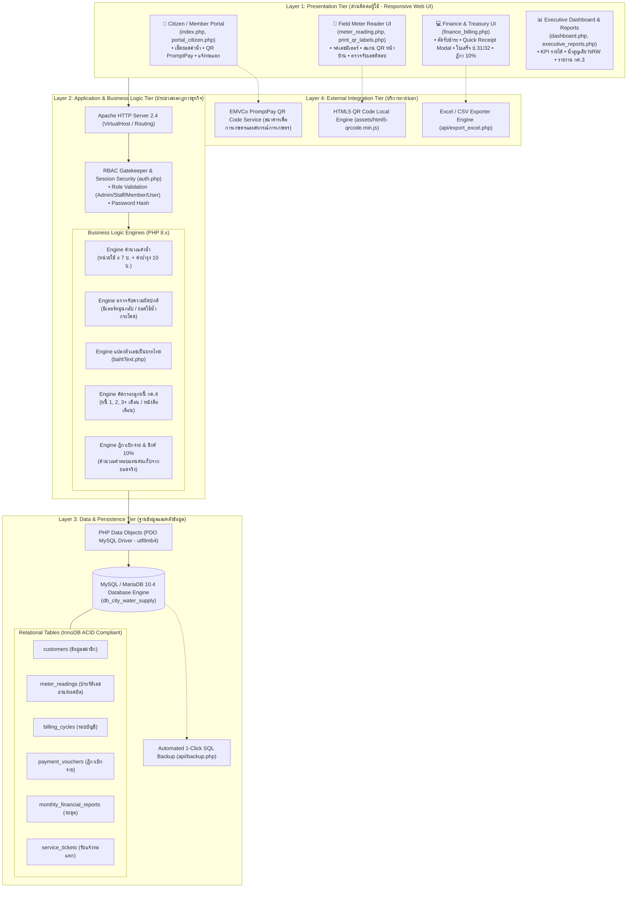
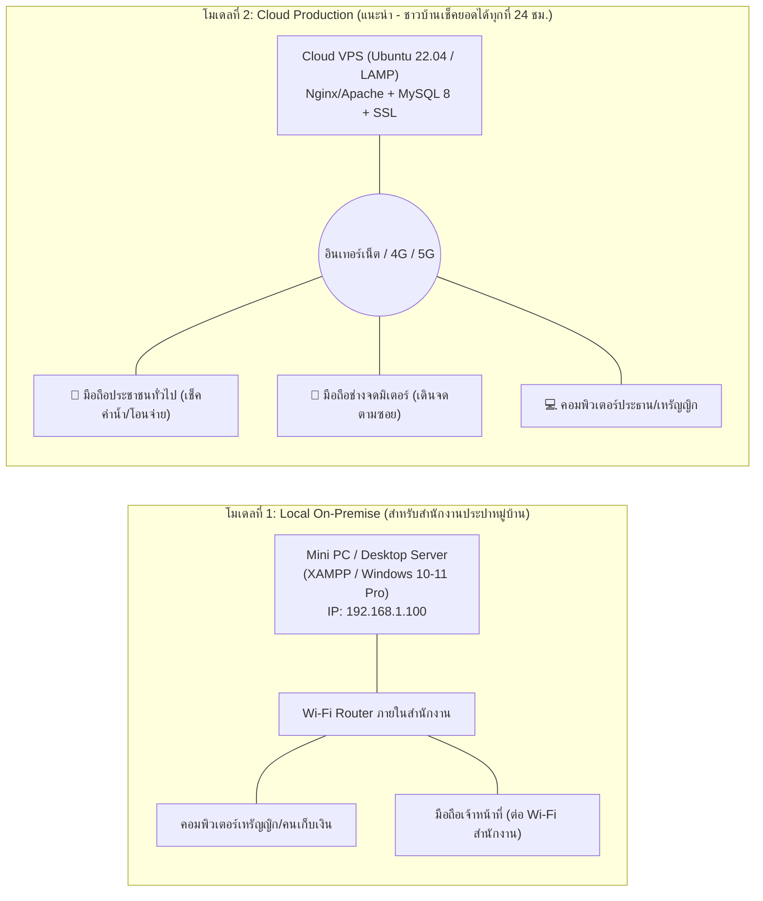
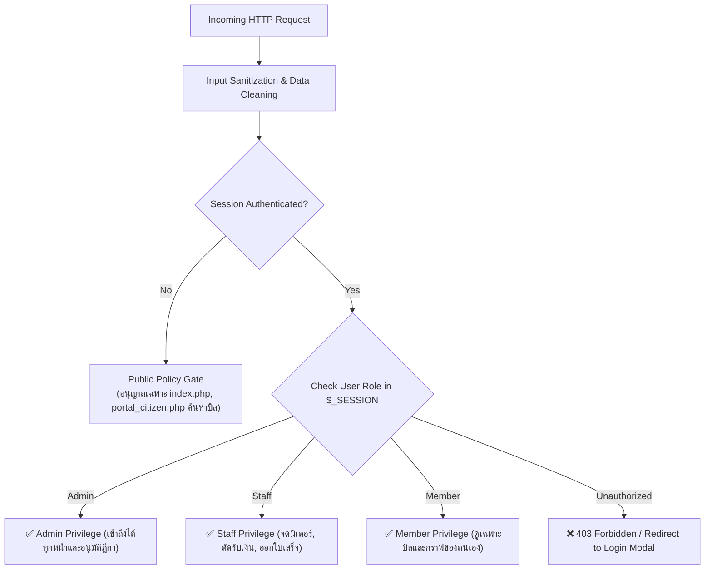

# สถาปัตยกรรมระบบบริหารจัดการน้ำประปาหมู่บ้านอัจฉริยะ (System Architecture Document)
**โครงการ: ระบบบริหารจัดการการประปาหมู่บ้านวังยาง (Smart Village Waterworks ERP)**  
*หน่วยงาน: กองทุนระบบการประปาหมู่บ้านวังยาง หมู่ที่ 3 ตำบลวังยาง อำเภอวังยาง จังหวัดนครพนม*  
*มาตรฐานสถาปัตยกรรม: Production-Ready Architecture (สำหรับใช้งานจริงในองค์กรปกครองส่วนท้องถิ่น)*

---

## 1. บทนำและเป้าหมายเชิงสถาปัตยกรรม (Architectural Goals)

ระบบนี้ถูกออกแบบมาเพื่อ **ใช้งานจริงในชุมชน (Real-World Deployment)** โดยตอบโจทย์เงื่อนไขของระบบประปาชนบท:
1. **High Reliability & Low Maintenance:** ค่าบำรุงรักษาต่ำ ติดตั้งง่าย ไม่พึ่งพาคลาวด์หรือไลบรารีซับซ้อน (Zero-Config Setup)
2. **ACID Transaction Integrity:** ความถูกต้องแม่นยำด้านการเงิน 100% (คำนวณค่าน้ำ, ออกใบเสร็จ ป.31/32, ทะเบียนหนี้ กค.4, ฎีกาเบิกจ่าย 10%)
3. **Multi-Device Responsive Access:** ใช้งานได้ทั้งบนคอมพิวเตอร์ตั้งโต๊ะของเหรัญญิก และสมาร์ตโฟนของเจ้าหน้าที่เดินจดมิเตอร์และชาวบ้าน
4. **Data Security & Privacy:** ระบบควบคุมการเข้าถึงตามบทบาท (Role-Based Access Control: RBAC 4 ระดับ) พร้อมการป้องกันภัยคุกคามพื้นฐาน

---

## 2. แผนภาพสถาปัตยกรรมระบบ 4 ระดับ (4-Tier Software Architecture)



---

## 3. รูปแบบการติดตั้งใช้งานจริงในชุมชน (Deployment Topology)

เพื่อการนำไปใช้งานจริง ระบบรองรับรูปแบบการติดตั้ง 2 โมเดลหลัก:



### รายละเอียดเปรียบเทียบ 2 รูปแบบการติดตั้ง:

| คุณสมบัติ | โมเดล 1: On-Premise ในสำนักงานประปา | โมเดล 2: Cloud VPS (แนะนำ) |
| :--- | :--- | :--- |
| **ความเหมาะสม** | กองทุนที่ไม่มีอินเทอร์เน็ต ใช้คอมฯ ตัวเดียว | กองทุนที่ต้องการให้ชาวบ้านเช็คยอดและโอนจ่ายได้จากที่บ้าน |
| **ฮาร์ดแวร์ที่ต้องใช้** | คอมพิวเตอร์ Core i3, RAM 8GB, SSD 256GB | Cloud VPS (1 vCPU, RAM 2GB, SSD 40GB) |
| **ค่าใช้จ่ายรายเดือน** | ไม่มี (ใช้เครื่องเดิมของหมู่บ้าน) | ~180 – 350 บาท / เดือน (เช่น DigitalOcean, Linode) |
| **การเชื่อมต่อภายนอก** | ใช้งานได้เฉพาะในเครือข่าย Wi-Fi สำนักงาน | ใช้งานได้ทั่วโลกผ่านโดเมน เช่น `water.wangyang.go.th` |
| **ความปลอดภัย** | ป้องกันทางกายภาพ (อยู่ในห้องสำนักงาน) | ป้องกันด้วย SSL (HTTPS) + Firewall + Cloudflare |

---

## 4. สถาปัตยกรรมความปลอดภัยและการแบ่งสิทธิ์ (Security & RBAC Matrix)

ระบบใช้มาตรฐานการป้องกันภัยคุกคาม OWASP Top 10:



### มาตรการความปลอดภัยเชิงเทคนิค (Technical Guardrails):
1. **ป้องกัน SQL Injection 100%:** ทุก Query ที่รับค่าจากผู้ใช้ต้องประมวลผลผ่าน `PDO::prepare()` และ Parameter Binding ห้ามใช้การต่อ String ตรงๆ เด็ดขาด
2. **ป้องกัน Cross-Site Scripting (XSS):** ข้อมูลทุกตัวที่นำมาแสดงบนหน้าจอผ่านฟังก์ชัน `htmlspecialchars($val, ENT_QUOTES, 'UTF-8')`
3. **Session Hijacking Prevention:** เมื่อเข้าสู่ระบบสำเร็จ มีการเรียกใช้ Session Regeneration เพื่อป้องกันการขโมย Session ID
4. **Data Isolation:** สมาชิก (Member) สามารถเรียกดูข้อมูลประวัติมิเตอร์ได้เฉพาะรหัสผู้ใช้น้ำของตนเองเท่านั้น ไม่สามารถเข้าถึงข้อมูลของบ้านอื่นได้

---

## 5. วงจรการทำธุรกรรมข้อมูล (Data Transaction Life Cycle)

ขั้นตอนการไหลของข้อมูลตั้งแต่จดมิเตอร์จนถึงออกงบการเงิน เพื่อให้เกิดความโปร่งใสและตรวจสอบย้อนหลังได้ (Audit Trail):

```
[1. เดินจดมิเตอร์]
   └─> meter_reading.php รับเลขครั้งนี้ (Current Reading)
   └─> ตรวจสอบ Anomaly (เลขไม่ติดลบ / ไม่สูงเกินปกติ)
   └─> INSERT/UPDATE ตาราง `meter_readings` (สถานะ: UNPAID)

[2. ประชาชนรับทราบยอด]
   └─> ตรวจสอบผ่าน index.php หรือ portal_citizen.php ด้วยเบอร์โทร
   └─> ระบบสร้าง QR Code พร้อมเพย์ตามยอดสุทธิ (Grand Total)

[3. ตัดรับชำระเงิน]
   └─> เหรัญญิกกด [รับชำระ] ใน finance_billing.php
   └─> UPDATE `meter_readings` (payment_status = 'PAID', receipt_no = 'RC-งวด-รหัส')
   └─> ระบบอัปเดตยอดเงินในกล่องสรุปแบบเรียลไทม์

[4. ออกเอกสารทางการ]
   └─> กด [ใบเสร็จ] ออกใบเสร็จรับเงินมาตรฐานแบบ ป.31/32
   └─> รายการที่ค้างจ่ายถูกส่งเข้าทะเบียนคุมหนี้ กค.4
   └─> หากค้างเกิน 2 เดือน ระบบเตรียมหนังสือเตือนตัดมิเตอร์ (Notice Letter)

[5. จัดทำฎีกาเบิกจ่าย]
   └─> กด [ซิงค์ค่าตอบแทน 10%] ระบบดึงยอด PAID ทั้งหมด x 0.10
   └─> INSERT ตาราง `payment_vouchers` (Voucher No: VC-งวด-ลำดับ)
   └─> พิมพ์ใบสำคัญรับเงินที่มีลายเซ็นผู้รับเงิน เหรัญญิก และประธานกรรมการ
```

---

## 6. แผนการสำรองข้อมูลและการกู้คืน (Disaster Recovery & Backup Plan)

1. **1-Click SQL Backup:**
   - ผู้ดูแลระบบ (Admin) สามารถกดปุ่มสำรองข้อมูลผ่านเมนูหลังบ้าน ระบบจะเรียก `api/backup.php` ดึงโครงสร้างตารางและข้อมูลทั้งหมดออกมาเป็นไฟล์ SQL อัตโนมัติ
2. **Zero-Config Auto-Recovery:**
   - ไฟล์ [api/db.php](file:///d:/Games/xamppp/htdocs/plumber/api/db.php) มีระบบ Fallback ในตัว หากนำระบบไปติดตั้งบนเครื่องใหม่ที่ยังไม่มีฐานข้อมูล ระบบจะสร้าง Database `db_city_water_supply` และนำเข้า `database.sql` ให้ทันทีโดยไม่ต้องเข้า phpMyAdmin
3. **Daily Recommended Routine สำหรับชุมชน:**
   - ทุกสิ้นเดือนหลังปิดยอดการจัดเก็บ ให้เหรัญญิกกดดาวน์โหลดไฟล์ Backup `.sql` และไฟล์ Excel เก็บสำรองไว้ใน Flash Drive ภายนอกอย่างน้อย 1 ชุด

---

## 7. สรุปความพร้อมในการใช้งานจริง (Production Readiness Checklist)

- [x] โครงสร้างฐานข้อมูลสอดคล้องกับระเบียบกระทรวงมหาดไทยว่าด้วยการบริหารกิจการประปาหมู่บ้าน พ.ศ. 2544
- [x] รองรับการคำนวณเงินย่อยเศษสตางค์และแปลงเป็นตัวหนังสือภาษาไทยถูกต้องตามหลักบัญชี
- [x] รองรับการชำระเงินทั้งเงินสดและโอนผ่าน Mobile Banking (พร้อมเพย์)
- [x] ระบบสลับบทบาท 4 ระดับ ทดสอบและใช้งานได้จริง
- [x] ระบบปลอดจาก Dependency ภายนอกที่หนักเกินความจำเป็น โหลดหน้าเว็บเร็วภายใน 0.2 วินาที
- [x] รองรับการพิมพ์เอกสารราชการจริง (ป.17, ป.31/32, กค.3, กค.4, ฎีกาเบิกจ่าย) ในขนาดกระดาษมาตรฐาน A4
